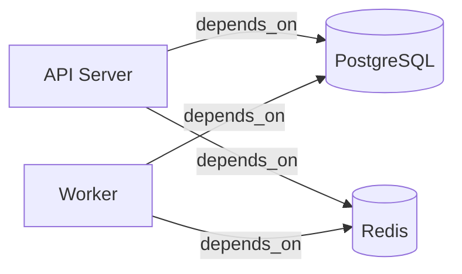

# docker-compose-to-mermaid

> Convert your docker-compose.yml into a Mermaid architecture diagram in one command.

[](https://github.com/TamirTapiro/docker-compose-to-mermaid/actions/workflows/ci.yml)
[](https://www.npmjs.com/package/docker-compose-to-mermaid)
[](LICENSE)

## Features

- **Automatic diagram generation** from docker-compose files with zero configuration
- **Intelligent inference** of service relationships from environment variables, ports, and network definitions
- **Multiple output formats**: Flowchart (default), C4 diagram, and experimental architecture diagrams
- **Fully offline** — no external APIs, no paid services required
- **Configurable output** — customize direction, styling, and included elements
- **GitHub Action** for automated architecture documentation in CI/CD pipelines
- **Node.js API** for programmatic use in your own tooling

## Quick Start

No installation required. Generate a diagram instantly:

```bash
npx docker-compose-to-mermaid generate
```

This command scans your current directory for `docker-compose.yml`, analyzes the services and their dependencies, and outputs a Mermaid diagram to stdout.

Example output for a typical service architecture:



## Installation

### Using npx (recommended for one-time use)

```bash
npx docker-compose-to-mermaid generate
```

### Global installation

Install globally with npm, yarn, or pnpm:

```bash
npm install -g docker-compose-to-mermaid
pnpm add -g docker-compose-to-mermaid
```

Then use the `dc2mermaid` or `docker-compose-to-mermaid` command:

```bash
dc2mermaid generate
```

### As a project dependency

Add to your project's devDependencies:

```bash
npm install --save-dev docker-compose-to-mermaid
```

Run via `npx` or add to your `package.json` scripts:

```json
{
  "scripts": {
    "diagram": "dc2mermaid generate"
  }
}
```

## Usage

### CLI Commands

#### `generate` — Create a Mermaid diagram

The primary command to convert a docker-compose file into a diagram.

```bash
dc2mermaid generate [file] [options]
```

**Arguments:**

| Argument | Description                     | Default                              |
| -------- | ------------------------------- | ------------------------------------ |
| `file`   | Path to docker-compose.yml file | Auto-discovered in current directory |

**Options:**

| Option                         | Short | Description                               | Default         |
| ------------------------------ | ----- | ----------------------------------------- | --------------- |
| `--output <file>`              | `-o`  | Write diagram to file instead of stdout   | stdout          |
| `--format <type>`              | `-f`  | Diagram format: `flowchart`, `c4`         | `flowchart`     |
| `--direction <dir>`            | `-d`  | Diagram direction: `LR`, `TB`, `BT`, `RL` | `LR`            |
| `--include-volumes`            |       | Include volume nodes in the diagram       | false           |
| `--include-network-boundaries` |       | Include network subgraphs                 | false           |
| `--strict`                     |       | Treat warnings as errors (exit code 2)    | false           |
| `--config <path>`              |       | Path to `.dc2mermaid.yml` config file     | Auto-discovered |

**Examples:**

```bash
# Generate and save to file
dc2mermaid generate docker-compose.yml -o diagram.mmd

# Generate with vertical layout and network boundaries
dc2mermaid generate --direction TB --include-network-boundaries

# Strict mode — exit with code 2 on any warnings
dc2mermaid generate --strict
```

#### `validate` — Check a docker-compose file

Validate a docker-compose file against the Docker Compose specification without generating a diagram.

```bash
dc2mermaid validate [file] [options]
```

**Options:**

| Option     | Description                            | Default |
| ---------- | -------------------------------------- | ------- |
| `--strict` | Treat warnings as errors (exit code 2) | false   |

**Examples:**

```bash
dc2mermaid validate docker-compose.yml
dc2mermaid validate --strict
```

#### `init` — Bootstrap configuration

Create a `.dc2mermaid.yml` configuration file in your project with sensible defaults.

```bash
dc2mermaid init [dir] [options]
```

**Arguments:**

| Argument | Description                          | Default           |
| -------- | ------------------------------------ | ----------------- |
| `dir`    | Target directory for the config file | Current directory |

**Options:**

| Option    | Description                    | Default |
| --------- | ------------------------------ | ------- |
| `--force` | Overwrite existing config file | false   |

**Example:**

```bash
dc2mermaid init
# Creates .dc2mermaid.yml in the current directory
```

### GitHub Action

Automate diagram generation in your CI/CD pipeline. The action runs whenever your docker-compose files change and optionally commits the updated diagram back to your repository.

**Step 1:** Add the action to your workflow (e.g., `.github/workflows/diagram.yml`):

```yaml
name: Update Architecture Diagram

on:
  push:
    paths:
      - 'docker-compose*.yml'
      - 'docker-compose*.yaml'

jobs:
  diagram:
    runs-on: ubuntu-latest
    permissions:
      contents: write

    steps:
      - uses: actions/checkout@v4
        with:
          fetch-depth: 1

      - uses: TamirTapiro/docker-compose-to-mermaid@v1
        with:
          output: docs/architecture.mmd
          format: flowchart
          direction: LR
          include-network-boundaries: 'true'
          commit-output: 'true'
          commit-message: 'chore: update architecture diagram [skip ci]'
```

**Step 2:** Add the diagram to your README:

```markdown
## Architecture


```

**Inputs:**

| Input                        | Description                                             | Default                              |
| ---------------------------- | ------------------------------------------------------- | ------------------------------------ |
| `file`                       | Path to docker-compose.yml (auto-discovered if omitted) | —                                    |
| `output`                     | Output file path                                        | `diagram.mmd`                        |
| `format`                     | Diagram format: `flowchart`, `c4`, `architecture`       | `flowchart`                          |
| `direction`                  | Diagram direction: `LR`, `TB`, `BT`, `RL`               | `LR`                                 |
| `include-volumes`            | Include volume nodes                                    | `false`                              |
| `include-network-boundaries` | Include network subgraphs                               | `false`                              |
| `commit-output`              | Commit generated diagram back to repository             | `false`                              |
| `commit-message`             | Commit message when `commit-output` is true             | `chore: update architecture diagram` |

**Outputs:**

| Output         | Description                        |
| -------------- | ---------------------------------- |
| `diagram-path` | Path to the generated diagram file |

**Important Notes:**

- The action requires Node 20+ (pre-installed on GitHub-hosted runners)
- To enable `commit-output` on push events, enable "Read and write permissions" in repository settings
- Pull requests from forks cannot write back to the repository; use `commit-output` only on `push` events

### Node.js API

Use the core library programmatically in your Node.js or TypeScript projects.

```bash
npm install dc2mermaid-core
```

**High-level API:**

```typescript
import { generate } from 'dc2mermaid-core';

const diagram = await generate({
  files: ['docker-compose.yml'],
  render: {
    type: 'flowchart',
    direction: 'LR',
    includeVolumes: false,
    includePorts: false,
    includeNetworkBoundaries: false,
    theme: {},
  },
  strict: false,
  verbose: false,
});

console.log(diagram);
```

**Step-by-step pipeline API:**

```typescript
import { parse, analyze, render } from 'dc2mermaid-core';

// Stage 1: Load and parse docker-compose file(s)
const composed = await parse(['docker-compose.yml']);

// Stage 2: Analyze services and infer relationships
const graph = analyze(composed);

// Stage 3: Render to Mermaid syntax
const diagram = render(graph, {
  type: 'flowchart',
  direction: 'LR',
  includeVolumes: false,
  includePorts: false,
  includeNetworkBoundaries: false,
  theme: {},
});

console.log(diagram);
```

**Export as JSON:**

```typescript
import { parse, analyze, toJSON } from 'dc2mermaid-core';

const composed = await parse(['docker-compose.yml']);
const graph = analyze(composed);
const json = toJSON(graph);

console.log(JSON.parse(json));
```

## Diagram Formats

### Flowchart (default)

A traditional flowchart showing services as nodes and dependencies as directed edges.

Best for:

- Quick visualization of service relationships
- GitHub README integration
- General-purpose documentation

```bash
dc2mermaid generate --format flowchart
```

### C4

A C4 model diagram showing system context, containers, components, and code.

Best for:

- Formal architecture documentation
- Multi-level system design
- Enterprise documentation standards

```bash
dc2mermaid generate --format c4
```

### Architecture (experimental)

A specialized architecture diagram format with advanced styling and grouping.

Best for:

- Advanced visualization needs
- Custom styling and themes
- Complex service architectures

```bash
dc2mermaid generate --format architecture
```

## Configuration

Create a `.dc2mermaid.yml` file in your project root to avoid repeating command-line flags:

```yaml
# dc2mermaid configuration
format: flowchart # flowchart | c4 | architecture
direction: LR # LR | TB | BT | RL
includeVolumes: false
includeNetworkBoundaries: false
strict: false

# Service display overrides (future feature)
# overrides:
#   myservice:
#     label: "My Custom Label"
#     shape: database

# Manual edges to supplement inferred relationships (future feature)
# edges:
#   - from: serviceA
#     to: serviceB
#     label: "custom relationship"
```

All configuration options correspond to CLI flags. CLI flags take precedence over config file settings.

Bootstrap a config file with sensible defaults:

```bash
dc2mermaid init
```

## How It Works

The tool converts docker-compose files to Mermaid diagrams through a four-stage pipeline:

1. **Parse** — Load and validate docker-compose file(s), merge overrides
2. **Analyze** — Extract services, volumes, networks, and infer service relationships through:
   - Explicit `depends_on` declarations
   - Environment variable URL patterns (e.g., `DATABASE_URL=postgres://db:5432/app`)
   - Port mappings and network configuration
   - Service name references in configuration
3. **Infer** — Apply intelligent strategies to detect connections the compose file doesn't explicitly declare
4. **Render** — Transform the analyzed graph into Mermaid syntax in your chosen format

The tool runs entirely offline and produces valid Mermaid syntax compatible with:

- GitHub Markdown
- GitLab Markdown
- Mermaid Live Editor
- VS Code Mermaid preview extensions
- Static site generators (Hugo, Jekyll, etc.)

## Contributing

We welcome contributions! Whether it's bug fixes, feature requests, documentation improvements, or code contributions:

1. Check [open issues](https://github.com/TamirTapiro/docker-compose-to-mermaid/issues)
2. Read [CONTRIBUTING.md](docs/CONTRIBUTING.md)
3. Review [docs/documentation.md](docs/documentation.md) for the technical architecture
4. Open an issue to discuss major changes before submitting a PR

For local development:

```bash
# Clone the repository
git clone https://github.com/TamirTapiro/docker-compose-to-mermaid.git
cd docker-compose-to-mermaid

# Install dependencies (Node 18+ required)
pnpm install

# Build all packages
pnpm build

# Run tests
pnpm test

# Run the CLI from source
pnpm exec dc2mermaid generate
```

## License

[MIT](LICENSE) — Use this tool freely in commercial and personal projects.

## Roadmap

See [docs/product.md](docs/product.md) for the planned features and version roadmap.

## Support

- **Issues:** [GitHub Issues](https://github.com/TamirTapiro/docker-compose-to-mermaid/issues)
- **Discussions:** [GitHub Discussions](https://github.com/TamirTapiro/docker-compose-to-mermaid/discussions)
- **Documentation:** [docs/](docs/)
