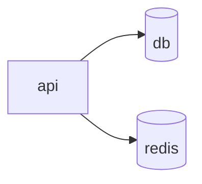
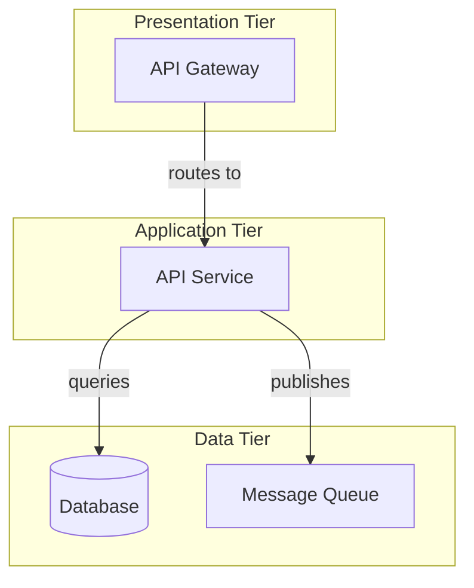

# Diagram Types Guide

Choose the right diagram type for your architecture documentation. This guide compares flowchart, C4, and architecture formats to help you pick the best option for your use case.

## Quick Decision Matrix

| Use Case                  | Flowchart | C4  | Architecture |
| ------------------------- | --------- | --- | ------------ |
| README documentation      | ✓✓✓       | ✓   | ✗            |
| Technical specs           | ✓✓        | ✓✓✓ | ✓✓           |
| Simple (< 5 services)     | ✓✓✓       | ✓✓  | ✗            |
| Medium (5-10 services)    | ✓✓        | ✓✓✓ | ✓✓           |
| Complex (> 10 services)   | ✓         | ✓✓  | ✓✓✓          |
| Non-technical audience    | ✓✓✓       | ✓   | ✗            |
| Technical team onboarding | ✓✓        | ✓✓✓ | ✓✓           |
| Enterprise presentations  | ✗         | ✓✓  | ✓✓✓          |
| Quick overviews           | ✓✓✓       | ✓   | ✗            |

Legend: ✓✓✓ = Excellent | ✓✓ = Good | ✓ = Acceptable | ✗ = Not recommended

---

## Flowchart Diagrams

The simplest diagram type showing services as nodes and dependencies as arrows.

### When to Use Flowchart

- README files and quick documentation
- Simple architectures with fewer than 8 services
- Getting started guides and tutorials
- Non-technical stakeholder communication
- Git commit messages and PR descriptions
- Rapid prototyping and concept validation

### How It Works

Services are represented as boxes or cylinders (for databases), with arrows showing relationships between them.

### Example

**Input:**

```yaml
services:
  api:
    depends_on: [db, redis]
  db: {}
  redis: {}
```

**Command:**

```bash
dc2mermaid generate --format flowchart
```

**Output:**



### Pros

- Simplest to understand at a glance
- Fastest diagram generation
- Clean, uncluttered appearance
- Works well with all system sizes
- Easy to read on small screens
- Best for presentations and talks

### Cons

- Limited detail about service roles
- Can become cluttered with many services (10+)
- Difficult to show detailed relationships or metadata
- Not suitable for formal architecture specifications
- Limited styling options for service types

### Customization Options

```bash
# Change direction
dc2mermaid generate --format flowchart --direction TB

# Include all details
dc2mermaid generate --format flowchart \
  --include-volumes \
  --include-network-boundaries
```

---

## C4 Component Diagrams

Hierarchical diagrams following the C4 model, showing components, containers, and detailed relationships.

### When to Use C4

- Technical architecture documentation
- Design reviews and architecture discussions
- Onboarding technical team members
- Medium complexity systems (5-15 services)
- Publication-ready documentation
- Formal architecture specifications

### How It Works

The C4 model structures diagrams into components and containers with explicit relationships. Services are categorized by type (API, Database, Cache, etc.) with clear relationship labels.

### Example

**Input:**

```yaml
services:
  api:
    image: myapp:1.0
    environment:
      DATABASE_URL: postgres://db:5432/app
      CACHE_URL: redis://cache:6379
    depends_on: [db, cache]

  db:
    image: postgres:15

  cache:
    image: redis:7
```

**Command:**

```bash
dc2mermaid generate --format c4
```

**Output:**

```mermaid
C4Component
  title API Architecture

  Container(api, "API Service", "Application", "REST API")
  Database(db, "PostgreSQL", "Database", "postgres:15")
  Container(cache, "Redis Cache", "Cache", "redis:7")

  Rel(api, db, "stores data", "postgres:5432")
  Rel(api, cache, "caches results", "redis")
```

### Pros

- Professional, publication-ready appearance
- Shows component roles and types clearly
- Explicit relationship labels for clarity
- Suitable for presentations and reports
- Better for detailed information and annotations
- Hierarchical structure aids understanding
- Industry-standard notation (C4 model)

### Cons

- More complex syntax than flowchart
- Slightly longer generation time
- May be overwhelming for simple systems
- Requires more context for non-technical readers
- Less effective on mobile devices

### Customization Options

```bash
# With full details
dc2mermaid generate --format c4 \
  --include-volumes \
  --include-network-boundaries

# Different layout
dc2mermaid generate --format c4 --direction TB
```

---

## Architecture Diagrams

Layered architecture diagrams showing tiers, components, and comprehensive system organization.

### When to Use Architecture

- Enterprise system documentation
- Complex multi-tier systems (10+ services)
- Production architecture specifications
- Board-level presentations
- Formal architecture documentation
- Systems with clear logical tiers or layers

### How It Works

Services are organized into logical tiers (presentation, application, data) as subgraphs. This makes the system structure and relationships explicit and clear.

### Example

**Input:**

```yaml
services:
  gateway:
    image: nginx:latest
    depends_on: [api]

  api:
    image: myapp:1.0
    depends_on: [db, queue]

  db:
    image: postgres:15

  queue:
    image: rabbitmq:3.12
```

**Command:**

```bash
dc2mermaid generate --format architecture
```

**Output:**



### Pros

- Shows logical tiers and layers clearly
- Comprehensive relationship visualization
- Excellent for complex systems
- Professional presentation quality
- Makes system organization explicit
- Ideal for enterprise documentation
- Clear separation of concerns

### Cons

- Most complex visual format
- Longest generation time
- Can overwhelm simple systems
- Requires more context for understanding
- Less effective for small architectures
- More difficult to read on small screens

### Customization Options

```bash
# With network and volume details
dc2mermaid generate --format architecture \
  --include-network-boundaries \
  --include-volumes

# Vertical layout for cascading systems
dc2mermaid generate --format architecture --direction TB
```

---

## Detailed Comparison

### Complexity Levels

| Metric                | Flowchart | C4       | Architecture |
| --------------------- | --------- | -------- | ------------ |
| Visual complexity     | Low       | Medium   | High         |
| Information density   | Low       | Medium   | High         |
| Generation time       | <50ms     | 50-100ms | 100-200ms    |
| Rendering performance | Excellent | Good     | Acceptable   |
| Mobile-friendly       | Yes       | Partial  | Limited      |
| Print-friendly        | Yes       | Yes      | Yes          |

### Information Shown

| Information         | Flowchart     | C4            | Architecture  |
| ------------------- | ------------- | ------------- | ------------- |
| Service names       | ✓             | ✓             | ✓             |
| Dependencies        | ✓             | ✓             | ✓             |
| Service types       | Implicit      | Explicit      | Explicit      |
| Relationship labels | ✓             | ✓✓            | ✓✓            |
| Volumes             | ✓ (with flag) | ✓ (with flag) | ✓ (with flag) |
| Networks            | ✓ (with flag) | ✓ (with flag) | ✓ (with flag) |
| Tiers/layers        | ✗             | ✗             | ✓             |
| Metadata            | Limited       | Good          | Good          |

---

## Decision Guide by System Size

### Small Systems (1-3 Services)

**Recommendation: Flowchart**

```yaml
services:
  web:
    depends_on: [api]
  api:
    depends_on: [db]
  db: {}
```

Use flowchart for simple systems. The overhead of C4 or architecture formats isn't justified.

```bash
dc2mermaid generate --format flowchart
```

---

### Medium Systems (5-10 Services)

**Recommendation: C4**

```yaml
services:
  gateway:
    depends_on: [api1, api2]
  api1:
    depends_on: [db, cache]
  api2:
    depends_on: [db, queue]
  db: {}
  cache: {}
  queue: {}
```

C4 provides good detail without overwhelming complexity.

```bash
dc2mermaid generate --format c4 \
  --include-network-boundaries
```

---

### Large Systems (10+ Services)

**Recommendation: Architecture**

For complex systems with multiple services across different layers, architecture diagrams make the organization clear.

```bash
dc2mermaid generate --format architecture \
  --include-volumes \
  --include-network-boundaries
```

---

## Audience Considerations

### For Non-Technical Stakeholders

Use **Flowchart** with minimal details:

```bash
dc2mermaid generate --format flowchart
```

### For Technical Teams

Use **C4** for balance between detail and readability:

```bash
dc2mermaid generate --format c4 \
  --include-network-boundaries
```

### For Architects and Leads

Use **Architecture** for comprehensive overview:

```bash
dc2mermaid generate --format architecture \
  --include-volumes \
  --include-network-boundaries
```

### For Executives/Board

Use **Architecture** with high-level labels:

```bash
dc2mermaid generate --format architecture
```

---

## Diagram Direction Selection

All formats support different directions. Choose based on content flow:

### Left-to-Right (LR) - Default

Best for sequential flows and most documentation.

```bash
dc2mermaid generate --direction LR
```

### Top-to-Bottom (TB)

Best for hierarchical structures and tiers.

```bash
dc2mermaid generate --direction TB
```

### Right-to-Left (RL)

Rarely used, sometimes helpful for RTL languages.

```bash
dc2mermaid generate --direction RL
```

### Bottom-to-Top (BT)

Rarely used, occasionally helpful for data flow emphasis.

```bash
dc2mermaid generate --direction BT
```

---

## Migration Path

Start simple and upgrade as complexity grows:

1. **Start with Flowchart** — Quick documentation, easy to understand
2. **Move to C4** — As services grow and detail matters
3. **Use Architecture** — When system becomes complex with clear tiers

Example progression:

```bash
# Phase 1: Simple project
dc2mermaid generate

# Phase 2: Growing system
dc2mermaid generate --format c4

# Phase 3: Enterprise system
dc2mermaid generate --format architecture \
  --include-volumes \
  --include-network-boundaries
```

---

## Configuration File Approach

Set your preferred format in `.dc2mermaid.yml`:

```yaml
diagram:
  type: c4 # flowchart | c4 | architecture
  direction: LR # LR | TB | BT | RL

display:
  volumes: true
  networks: true
```

Then generate without flags:

```bash
dc2mermaid generate
```

---

## Combining Multiple Diagrams

Document different aspects with different diagrams:

```bash
# Overview for README
dc2mermaid generate --format flowchart \
  -o docs/architecture-overview.mmd

# Technical details
dc2mermaid generate --format c4 \
  --include-network-boundaries \
  -o docs/architecture-detailed.mmd

# Enterprise view
dc2mermaid generate --format architecture \
  --include-volumes \
  -o docs/architecture-enterprise.mmd
```

Reference in documentation:

```markdown
## Quick Overview


## Technical Details


## Enterprise Architecture


```

---

## Best Practices

1. **Default to Flowchart** — Start here unless you have specific requirements
2. **Match audience** — Adjust complexity for your readers
3. **Include context** — Add README sections explaining the diagram
4. **Keep updated** — Regenerate diagrams when architecture changes
5. **Version in Git** — Commit generated diagrams alongside docker-compose files
6. **Combine with text** — Diagrams work best with written descriptions
7. **Test readability** — Ensure the diagram is readable at various sizes

---

## Next Steps

- **[Examples](./EXAMPLES.md)** — See all formats in action
- **[CLI Reference](./cli-reference.md)** — Complete command options
- **[Getting Started](./getting-started.md)** — Quick tutorial
- **[Configuration Reference](./configuration.md)** — Advanced setup
