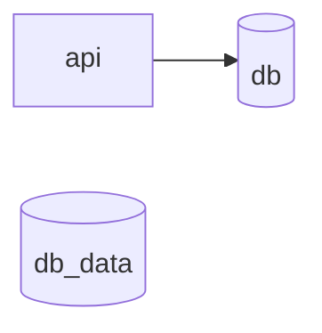
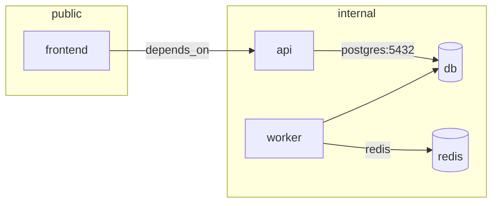
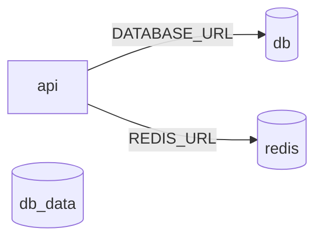
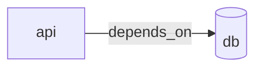
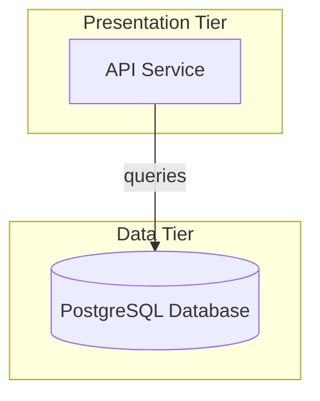
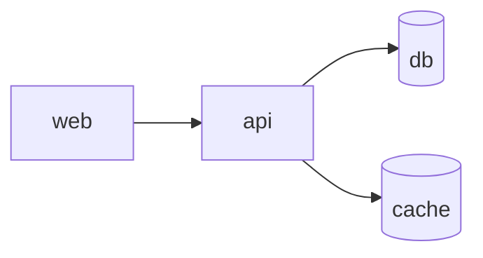
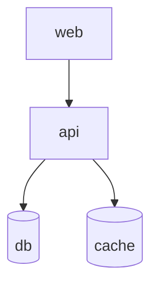

# Example Gallery

Real-world examples showing how to use docker-compose-to-mermaid with different configurations and diagram formats.

## Example 1: Simple Web API

A minimal setup with an API service and a PostgreSQL database.

### Docker Compose File

```yaml
services:
  api:
    build: ./api
    ports:
      - '3000:3000'
    depends_on:
      - db

  db:
    image: postgres:15
    volumes:
      - db_data:/var/lib/postgresql/data

volumes:
  db_data:
```

### Command

```bash
dc2mermaid generate
```

### Output: Flowchart Diagram



The diagram shows:

- **api** — Regular service node
- **db** — Database node (cylinder shape indicates database type)
- **db_data** — Volume node
- **Arrow** — The dependency relationship (api depends on db)

---

## Example 2: Microservices with Multiple Networks

A complex microservices architecture with multiple services on different networks.

### Docker Compose File

```yaml
version: '3.9'

services:
  frontend:
    build: ./frontend
    ports:
      - '80:80'
    networks:
      - public
      - internal

  api:
    build: ./api
    depends_on:
      - db
    networks:
      - internal

  db:
    image: postgres:15
    networks:
      - internal

  worker:
    build: ./worker
    depends_on:
      - redis
      - db
    networks:
      - internal

  redis:
    image: redis:7
    ports:
      - '6379:6379'
    networks:
      - internal

networks:
  public:
  internal:
```

### Command

```bash
dc2mermaid generate --include-network-boundaries
```

### Output: Flowchart with Network Boundaries



The diagram now shows:

- **Subgraphs** — Network boundaries as labeled containers
- **Service placement** — frontend is on the public network, others on internal
- **Cross-network relationships** — frontend to api connection spans networks

---

## Example 3: Development Override

Using docker-compose base file with an override file for local development.

### Base Docker Compose File (docker-compose.yml)

```yaml
version: '3.9'

services:
  api:
    image: myapp:latest
    environment:
      DATABASE_URL: postgres://db:5432/app
      REDIS_URL: redis://redis:6379
    depends_on:
      - db
      - redis

  db:
    image: postgres:15
    environment:
      POSTGRES_DB: app

  redis:
    image: redis:7
```

### Development Override File (docker-compose.override.yml)

```yaml
version: '3.9'

services:
  api:
    build: ./api
    ports:
      - '3000:3000'
    volumes:
      - ./api:/app

  db:
    ports:
      - '5432:5432'
    volumes:
      - db_data:/var/lib/postgresql/data

  redis:
    ports:
      - '6379:6379'

volumes:
  db_data:
```

### Command

```bash
dc2mermaid generate docker-compose.yml docker-compose.override.yml
```

### Output: Merged Configuration Diagram



The merged diagram shows:

- **Base configuration** — Images and core dependencies from docker-compose.yml
- **Override merging** — Additional ports and volumes from override file
- **Complete picture** — All relationships visible in one diagram
- **Development ready** — The merged setup is what docker-compose actually uses

---

## Example 4: Diagram Type Comparison

The same docker-compose configuration rendered in different diagram formats to help you choose the best one for your documentation.

### Base Configuration (simple-api.yml)

```yaml
version: '3.9'

services:
  api:
    build: ./api
    ports:
      - '3000:3000'
    environment:
      DATABASE_URL: postgres://db:5432/app
    depends_on:
      - db

  db:
    image: postgres:15
    environment:
      POSTGRES_DB: app
```

### Format 1: Flowchart (Default)

**Command:**

```bash
dc2mermaid generate --format flowchart
```

**Output:**



**Best for:** README files, quick documentation, simple architectures

---

### Format 2: C4 Component Diagram

**Command:**

```bash
dc2mermaid generate --format c4
```

**Output:**

```mermaid
C4Component
  title API Architecture

  Container(api, "API", "Application", "REST API Service")
  Database(db, "PostgreSQL", "Database", "postgres:15")

  Rel(api, db, "stores data", "PostgreSQL connection")
```

**Best for:** Technical documentation, architecture reviews, formal specifications

---

### Format 3: Architecture Diagram

**Command:**

```bash
dc2mermaid generate --format architecture
```

**Output:**



**Best for:** Enterprise systems, complex architectures, presentations

---

## Example 5: Layout Variations

The same diagram in different directions to suit your documentation layout.

### Base Configuration

```yaml
services:
  web:
    depends_on: [api]
  api:
    depends_on: [db, cache]
  db: {}
  cache: {}
```

### Left-to-Right (LR) - Default

**Command:**

```bash
dc2mermaid generate --direction LR
```

**Output:**



**Best for:** Wide displays, most common layout

---

### Top-to-Bottom (TB)

**Command:**

```bash
dc2mermaid generate --direction TB
```

**Output:**



**Best for:** Tall screens, cascade-like flows, hierarchical structures

---

## Common Use Cases

### Use Case: Add to README.md

Generate and embed a diagram in your project README:

```bash
dc2mermaid generate -o docs/architecture.mmd
```

Then add to `README.md`:

````markdown
## Architecture

```mermaid
{{ include docs/architecture.mmd }}
```
````

Or use the diagram directly:

```markdown
## Architecture


```

### Use Case: Validate Configuration in CI

Add diagram validation to your CI/CD pipeline:

```bash
#!/bin/bash
set -e

# Validate docker-compose files
dc2mermaid validate --strict

# Generate diagram (fails if invalid)
dc2mermaid generate -o docs/architecture.mmd

# Commit updated diagram
git add docs/architecture.mmd
```

### Use Case: Documentation Site

Generate diagrams for different environments:

```bash
# Development environment
dc2mermaid generate docker-compose.dev.yml \
  -o docs/architecture-dev.mmd

# Production environment
dc2mermaid generate docker-compose.prod.yml \
  -o docs/architecture-prod.mmd

# Staging environment
dc2mermaid generate docker-compose.staging.yml \
  -o docs/architecture-staging.mmd
```

Then create a comparison document in `docs/ARCHITECTURE.md`:

```markdown
# Architecture Documentation

## Development Architecture


## Staging Architecture


## Production Architecture


```

### Use Case: Service Discovery Documentation

Document all services in your system:

```bash
dc2mermaid generate \
  --include-network-boundaries \
  --include-volumes \
  -o docs/service-map.mmd
```

Share the generated diagram in team documentation to help new team members understand the system architecture.

## Tips for Better Diagrams

1. **Keep it simple** — Start with the default flowchart format, upgrade to C4 or architecture only if needed
2. **Use meaningful names** — Service names become labels in the diagram
3. **Include volumes** — Use `--include-volumes` to show data persistence
4. **Show networks** — Use `--include-network-boundaries` to highlight service isolation
5. **Version your diagrams** — Commit generated diagrams to git alongside docker-compose files
6. **Update regularly** — Regenerate diagrams when your architecture changes

## Next Steps

- **[CLI Reference](./cli-reference.md)** — Complete command documentation
- **[Diagram Types Guide](./DIAGRAM_TYPES.md)** — Detailed comparison of diagram formats
- **[Getting Started](./getting-started.md)** — Quick start tutorial
- **[Configuration Reference](./configuration.md)** — Advanced configuration options
