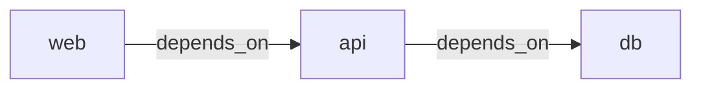
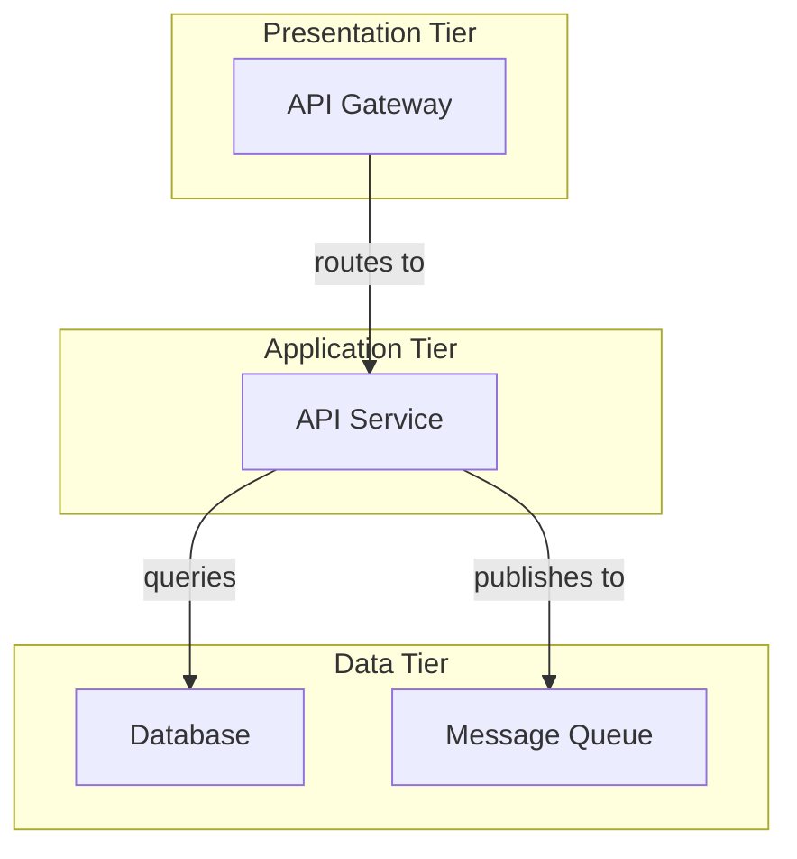

# docker-compose-to-mermaid Documentation Strategy

Production-grade documentation for the docker-compose-to-mermaid CLI tool. This document outlines the complete documentation structure, content guidelines, and implementation roadmap.

**Document Status**: Production Documentation Strategy
**Last Updated**: March 2026
**Target Audience**: Backend Engineers, DevOps Engineers, Platform Engineers, Open Source Contributors

---

## Table of Contents

1. [Documentation Architecture](#documentation-architecture)
2. [README.md Structure and Content](#readmemd-structure-and-content)
3. [CLI Reference Documentation](#cli-reference-documentation)
4. [Getting Started Guide](#getting-started-guide)
5. [Example Gallery](#example-gallery)
6. [GitHub Action Usage](#github-action-usage)
7. [Configuration File Reference](#configuration-file-reference)
8. [Diagram Type Comparison Guide](#diagram-type-comparison-guide)
9. [Contributing Guide](#contributing-guide)
10. [Changelog Format](#changelog-format)
11. [Troubleshooting Guide](#troubleshooting-guide)
12. [FAQ](#faq)
13. [Documentation Site Strategy](#documentation-site-strategy)
14. [Writing Standards and Conventions](#writing-standards-and-conventions)

---

## Documentation Architecture

### Directory Structure

```
docker-compose-to-mermaid/
├── README.md                          # Primary entry point
├── docs/
│   ├── documentation.md               # This file
│   ├── GETTING_STARTED.md             # Quick start guide
│   ├── CLI_REFERENCE.md               # Complete CLI documentation
│   ├── CONFIGURATION.md               # Config file reference
│   ├── DIAGRAM_TYPES.md               # Diagram type guide
│   ├── GITHUB_ACTIONS.md              # GitHub Action integration
│   ├── EXAMPLES.md                    # Example gallery
│   ├── TROUBLESHOOTING.md             # Troubleshooting guide
│   ├── FAQ.md                         # Frequently asked questions
│   ├── CONTRIBUTING.md                # Contributing guide
│   ├── CODE_OF_CONDUCT.md             # Community guidelines
│   └── examples/                      # Example files
│       ├── simple-api.yml             # Simple API example
│       ├── microservices.yml          # Complex microservices
│       └── outputs/                   # Example outputs
│           ├── simple-api-flowchart.md
│           ├── simple-api-c4.md
│           └── microservices-architecture.md
├── CHANGELOG.md                       # Version history
├── .compose2mermaid.json              # Default config example
└── .github/
    └── workflows/
        └── ci-docs.yml                # Documentation CI workflow
```

### File Ownership and Update Frequency

| File | Owner | Frequency | Purpose |
|------|-------|-----------|---------|
| README.md | Project Lead | Per release | Primary entry point, feature overview |
| GETTING_STARTED.md | Technical Writer | Per release | Onboarding new users |
| CLI_REFERENCE.md | Developer | Per feature/flag addition | Complete command documentation |
| CONFIGURATION.md | Developer | Per config addition | Configuration options |
| DIAGRAM_TYPES.md | Technical Writer | Quarterly | Visual comparison guide |
| GITHUB_ACTIONS.md | DevOps Lead | Per integration | CI/CD integration examples |
| EXAMPLES.md | Community | Ongoing | Real-world examples |
| TROUBLESHOOTING.md | Support Team | Ongoing | Common issues and solutions |
| FAQ.md | Support Team | Monthly | User questions and answers |
| CONTRIBUTING.md | Project Lead | Per policy change | Development setup and process |
| CHANGELOG.md | Developer | Per release | Version history |

---

## README.md Structure and Content

### Complete README.md Outline and Content

```markdown
# docker-compose-to-mermaid

[](https://www.npmjs.com/package/docker-compose-to-mermaid)
[](https://github.com/[owner]/docker-compose-to-mermaid/blob/main/LICENSE)
[](https://www.npmjs.com/package/docker-compose-to-mermaid)
[](https://github.com/[owner]/docker-compose-to-mermaid/actions)

Convert Docker Compose configurations into Mermaid architecture diagrams instantly. Works offline. No external dependencies required.

[Quick Start](#quick-start) • [Examples](#examples) • [Documentation](./docs/) • [Contributing](./docs/CONTRIBUTING.md)

## Overview

**docker-compose-to-mermaid** analyzes your Docker Compose files and generates visual architecture diagrams in Mermaid syntax. Perfect for:

- Documenting your infrastructure architecture
- Onboarding new team members
- Adding architecture diagrams to your README
- Understanding service dependencies at a glance
- Automating architecture documentation in CI/CD pipelines

### Why Use This Tool?

- **Offline-First**: No external APIs or internet connection required
- **Zero Configuration**: Works out of the box with sensible defaults
- **Multiple Diagram Types**: Flowchart, C4 Component, Architecture diagrams
- **CI/CD Ready**: Available as GitHub Action and npm package
- **Blazingly Fast**: Processes most docker-compose files in milliseconds
- **Open Source**: MIT licensed, community-driven development

## Quick Start

### Installation

**Option 1: Global Installation**
```bash
npm install -g docker-compose-to-mermaid
docker-compose-to-mermaid --input docker-compose.yml --output architecture.md
```

**Option 2: Zero-Install (npx)**
```bash
npx docker-compose-to-mermaid --input docker-compose.yml --output architecture.md
```

**Option 3: Local Installation**
```bash
npm install --save-dev docker-compose-to-mermaid
npx docker-compose-to-mermaid --input docker-compose.yml --output architecture.md
```

### Your First Diagram (30 seconds)

1. Navigate to your project with a `docker-compose.yml`
2. Run one command:
   ```bash
   docker-compose-to-mermaid --input docker-compose.yml --output diagram.md
   ```
3. Open `diagram.md` in your editor or GitHub—your diagram is ready!

For detailed setup instructions, see [Getting Started Guide](./docs/GETTING_STARTED.md).

## Examples

### Simple API with Database

**Input**: `docker-compose.yml`
```yaml
services:
  api:
    image: myapi:latest
    ports: ["3000:3000"]
    depends_on: [db]
  db:
    image: postgres:15
    volumes: [db_data:/var/lib/postgresql/data]
volumes:
  db_data:
```

**Output**: Mermaid diagram in Markdown
```
graph LR
    api["api<br/>myapi:latest"]
    db["db<br/>postgres:15"]
    api -->|depends_on| db
```

See more examples in [Example Gallery](./docs/EXAMPLES.md).

## Features

### Diagram Types

| Type | Best For | Use Case |
|------|----------|----------|
| **Flowchart** | Quick visualization | Simple overviews, README |
| **C4 Component** | Technical architecture | Detailed architecture docs |
| **Architecture** | Enterprise systems | Complex multi-tier systems |

### Supported Elements

- Services and their images
- Service dependencies (`depends_on`)
- Volume mounts and named volumes
- Custom networks and network connections
- Environment variable hints
- Port mappings

See [Diagram Types Guide](./docs/DIAGRAM_TYPES.md) for detailed comparisons.

## Command-Line Reference

### Basic Usage

```bash
docker-compose-to-mermaid [options]
```

### Essential Flags

| Flag | Description | Default |
|------|-------------|---------|
| `--input` | Path to docker-compose file | `docker-compose.yml` |
| `--output` | Output file path | `stdout` |
| `--diagram-type` | Type: `flowchart`, `c4`, `architecture` | `flowchart` |
| `--format` | Output format: `markdown`, `mermaid` | `markdown` |
| `--include-volumes` | Include volume information in diagram | `false` |
| `--include-networks` | Include network information in diagram | `false` |

See [CLI Reference](./docs/CLI_REFERENCE.md) for complete documentation.

## Configuration

Use `.compose2mermaid.json` in your project root for persistent settings:

```json
{
  "input": "docker-compose.prod.yml",
  "diagram-type": "c4",
  "include-volumes": true,
  "include-networks": true,
  "output": "docs/architecture.md"
}
```

See [Configuration Guide](./docs/CONFIGURATION.md) for all options.

## GitHub Actions Integration

Automatically generate diagrams in CI/CD:

```yaml
name: Update Architecture Diagram
on: [push]

jobs:
  diagram:
    runs-on: ubuntu-latest
    steps:
      - uses: actions/checkout@v4
      - uses: docker-compose-to-mermaid/action@v1
        with:
          input: docker-compose.yml
          output: docs/architecture.md
      - uses: actions/upload-artifact@v3
        with:
          name: architecture-diagram
          path: docs/architecture.md
```

See [GitHub Actions Guide](./docs/GITHUB_ACTIONS.md) for advanced workflows.

## Troubleshooting

**Issue**: File not found error
- Ensure `docker-compose.yml` exists in current directory or use `--input` flag

**Issue**: Diagram looks incomplete
- Check if services use `depends_on` or `links` for relationships
- Use `--include-volumes` and `--include-networks` flags

**Issue**: Invalid Mermaid syntax
- This is rare and indicates a bug. Please [file an issue](https://github.com/[owner]/docker-compose-to-mermaid/issues)

See [Troubleshooting Guide](./docs/TROUBLESHOOTING.md) for more solutions.

## Documentation

- [Getting Started](./docs/GETTING_STARTED.md) — Installation and first run
- [CLI Reference](./docs/CLI_REFERENCE.md) — Complete command documentation
- [Configuration](./docs/CONFIGURATION.md) — Configuration file reference
- [Diagram Types](./docs/DIAGRAM_TYPES.md) — When to use each diagram type
- [Examples](./docs/EXAMPLES.md) — Real-world usage examples
- [GitHub Actions](./docs/GITHUB_ACTIONS.md) — CI/CD integration
- [Troubleshooting](./docs/TROUBLESHOOTING.md) — Common issues and solutions
- [FAQ](./docs/FAQ.md) — Frequently asked questions

## Contributing

We welcome contributions! See [Contributing Guide](./docs/CONTRIBUTING.md) for:

- Development environment setup
- Running tests
- Submitting pull requests
- Code standards

## Support

- **Issues**: [GitHub Issues](https://github.com/[owner]/docker-compose-to-mermaid/issues)
- **Discussions**: [GitHub Discussions](https://github.com/[owner]/docker-compose-to-mermaid/discussions)
- **Documentation**: [docs/](./docs/)

## Changelog

See [CHANGELOG.md](./CHANGELOG.md) for version history and breaking changes.

## License

MIT License - see [LICENSE](./LICENSE) file for details.

## Acknowledgments

- Built with [Mermaid.js](https://mermaid.js.org)
- Inspired by the need for automated architecture documentation
- Thanks to all [contributors](https://github.com/[owner]/docker-compose-to-mermaid/graphs/contributors)

---

**Questions?** Check [FAQ](./docs/FAQ.md) or [open a discussion](https://github.com/[owner]/docker-compose-to-mermaid/discussions)
```

---

## CLI Reference Documentation

### CLI_REFERENCE.md Content

```markdown
# Command-Line Reference

Complete documentation for docker-compose-to-mermaid CLI flags, options, and behaviors.

## Command Syntax

```bash
docker-compose-to-mermaid [options]
```

## Global Options

### `--input <path>`

**Type**: `string`
**Default**: `docker-compose.yml`
**Required**: No

Path to the docker-compose file to parse.

**Examples**:
```bash
docker-compose-to-mermaid --input docker-compose.yml
docker-compose-to-mermaid --input ./deploy/docker-compose.prod.yml
docker-compose-to-mermaid --input /absolute/path/to/compose.yaml
```

**Notes**:
- Supports absolute and relative paths
- Resolves relative paths from current working directory
- Searches for `docker-compose.yml` if not specified

---

### `--output <path>`

**Type**: `string`
**Default**: `stdout`
**Required**: No

File path for diagram output. If not specified, outputs to stdout.

**Examples**:
```bash
docker-compose-to-mermaid --output architecture.md
docker-compose-to-mermaid --output ./docs/diagrams/services.md
docker-compose-to-mermaid --output - # explicit stdout
```

**Notes**:
- Creates parent directories if they don't exist
- Overwrites existing files without prompting
- Use `-` to force stdout output

---

### `--diagram-type <type>`

**Type**: `enum`
**Default**: `flowchart`
**Required**: No
**Valid Values**: `flowchart`, `c4`, `architecture`

Type of diagram to generate. Choose based on your needs and audience.

**Examples**:
```bash
docker-compose-to-mermaid --diagram-type flowchart
docker-compose-to-mermaid --diagram-type c4
docker-compose-to-mermaid --diagram-type architecture
```

**Diagram Types**:

| Type | Description | Best For |
|------|-------------|----------|
| `flowchart` | Simple node-link diagram | Quick overviews, READMEs |
| `c4` | C4 component diagram | Technical architecture docs |
| `architecture` | Layered architecture | Enterprise/complex systems |

See [Diagram Types Guide](./DIAGRAM_TYPES.md) for detailed comparisons.

---

### `--format <format>`

**Type**: `enum`
**Default**: `markdown`
**Required**: No
**Valid Values**: `markdown`, `mermaid`

Output format for the diagram.

**Examples**:
```bash
docker-compose-to-mermaid --format markdown    # Includes Markdown wrapper
docker-compose-to-mermaid --format mermaid     # Raw Mermaid syntax
```

**Output Differences**:

**markdown** (default):
```markdown
# Service Architecture

\`\`\`mermaid
graph LR
    ...diagram...
\`\`\`
```

**mermaid** (raw):
```
graph LR
    ...diagram...
```

---

### `--include-volumes`

**Type**: `boolean`
**Default**: `false`
**Required**: No

Include volume information in the diagram.

**Examples**:
```bash
docker-compose-to-mermaid --include-volumes
docker-compose-to-mermaid --include-volumes true
```

**Behavior**:
- Shows named volumes and their mount points
- Displays volume persistence information
- Increases diagram complexity

**Example Output**:
```
api -->|uses| db_data[/db_data<br/>Volume]
```

---

### `--include-networks`

**Type**: `boolean`
**Default**: `false`
**Required**: No

Include custom network information in the diagram.

**Examples**:
```bash
docker-compose-to-mermaid --include-networks
docker-compose-to-mermaid --include-networks true
```

**Behavior**:
- Shows all custom networks
- Displays which services connect to which networks
- Groups services by network membership

---

### `--config <path>`

**Type**: `string`
**Default**: `.compose2mermaid.json`
**Required**: No

Path to configuration file.

**Examples**:
```bash
docker-compose-to-mermaid --config .compose2mermaid.json
docker-compose-to-mermaid --config ./config/diagram-settings.json
```

**Notes**:
- CLI flags override config file settings
- Supports absolute and relative paths

---

### `--help`, `-h`

Display help information and exit.

```bash
docker-compose-to-mermaid --help
```

---

### `--version`, `-v`

Display version information and exit.

```bash
docker-compose-to-mermaid --version
```

---

## Exit Codes

| Code | Meaning | Common Causes |
|------|---------|---------------|
| `0` | Success | Command completed successfully |
| `1` | General Error | Unexpected error occurred |
| `2` | Invalid Arguments | Missing required flag or invalid value |
| `3` | File Not Found | Input file doesn't exist |
| `4` | Parse Error | Invalid YAML syntax in docker-compose file |
| `5` | Write Error | Cannot write to output file |
| `6` | Config Error | Invalid configuration file |
| `7` | Unsupported Version | Docker Compose version not supported |

---

## Usage Examples

### Basic Usage
```bash
# Default: read docker-compose.yml, output to stdout
docker-compose-to-mermaid
```

### Save to File
```bash
# Generate flowchart and save to architecture.md
docker-compose-to-mermaid --output architecture.md
```

### Custom Diagram Type
```bash
# Generate C4 architecture diagram
docker-compose-to-mermaid --input docker-compose.yml --diagram-type c4 --output docs/architecture.md
```

### Include All Details
```bash
# Include volumes and networks, generate C4 diagram, save to docs
docker-compose-to-mermaid \
  --input docker-compose.prod.yml \
  --diagram-type c4 \
  --include-volumes \
  --include-networks \
  --output docs/prod-architecture.md
```

### Using with NPM Script
```bash
# package.json
{
  "scripts": {
    "diagram": "docker-compose-to-mermaid --output docs/architecture.md",
    "diagram:detailed": "docker-compose-to-mermaid --diagram-type c4 --include-volumes --include-networks --output docs/detailed-architecture.md"
  }
}
```

### With Configuration File
```bash
# .compose2mermaid.json defines defaults
docker-compose-to-mermaid --config .compose2mermaid.json
```

---

## Flag Combinations and Precedence

1. **Highest Priority**: Command-line flags
2. **Medium Priority**: Configuration file settings
3. **Lowest Priority**: Default values

**Example**:
```bash
# .compose2mermaid.json has diagram-type: "flowchart"
# CLI flag overrides it
docker-compose-to-mermaid --diagram-type c4
# Result: C4 diagram is generated (CLI flag wins)
```

---

## Error Messages and Resolution

### "File not found: docker-compose.yml"

**Cause**: Input file doesn't exist in current directory
**Solution**:
```bash
# Specify correct path
docker-compose-to-mermaid --input /path/to/docker-compose.yml

# Check file exists
ls -la docker-compose.yml
```

### "Invalid YAML syntax"

**Cause**: docker-compose file has YAML errors
**Solution**:
```bash
# Validate YAML
yamllint docker-compose.yml

# Fix YAML syntax errors
# Common issues: incorrect indentation, invalid quotes
```

### "Cannot write to output file"

**Cause**: Permission denied or directory doesn't exist
**Solution**:
```bash
# Check permissions
ls -la docs/

# Create directory if needed
mkdir -p docs

# Try again
docker-compose-to-mermaid --output docs/architecture.md
```

---

## Performance Notes

- Most docker-compose files process in < 100ms
- Diagram size increases with complexity
- C4 and architecture diagrams take slightly longer than flowchart
- Include flags increase processing time by ~10%

---
```

---

## Getting Started Guide

### GETTING_STARTED.md Content

```markdown
# Getting Started with docker-compose-to-mermaid

Learn how to install and create your first architecture diagram in minutes.

## Prerequisites

- **Node.js**: v14.0 or higher
- **npm**: v6.0 or higher (included with Node.js)
- **Docker Compose file**: A valid `docker-compose.yml` file

Check your versions:
```bash
node --version  # v14.0.0 or higher
npm --version   # v6.0.0 or higher
```

## Installation

### Option 1: Global Installation (Recommended for frequent use)

Install globally and use from anywhere:

```bash
npm install -g docker-compose-to-mermaid
```

Verify installation:
```bash
docker-compose-to-mermaid --version
```

**Pros**: Available in any directory, simple command
**Cons**: Uses global npm namespace

---

### Option 2: Local Installation (Recommended for projects)

Install as a development dependency in your project:

```bash
npm install --save-dev docker-compose-to-mermaid
```

Add to `package.json` scripts:
```json
{
  "scripts": {
    "diagram": "docker-compose-to-mermaid"
  }
}
```

Run with:
```bash
npm run diagram
```

**Pros**: Per-project control, version pinned in package.json
**Cons**: Must install per project

---

### Option 3: Zero-Install (Quick one-off use)

Use without installation via npx:

```bash
npx docker-compose-to-mermaid --version
```

**Pros**: No installation needed, always latest version
**Cons**: Downloads and installs every time (slower for repeated use)

---

## Your First Diagram (5 minutes)

### Step 1: Prepare Your Docker Compose File

If you don't have one yet, create a simple `docker-compose.yml`:

```yaml
version: "3.9"

services:
  web:
    image: nginx:latest
    ports:
      - "80:80"
    depends_on:
      - api

  api:
    image: myapp:latest
    ports:
      - "3000:3000"
    depends_on:
      - db

  db:
    image: postgres:15
    volumes:
      - db_data:/var/lib/postgresql/data

volumes:
  db_data:
```

### Step 2: Generate Your Diagram

Run one simple command:

```bash
docker-compose-to-mermaid --input docker-compose.yml --output diagram.md
```

**What just happened?**
- The tool read your `docker-compose.yml`
- Analyzed services and their relationships
- Generated a Mermaid diagram
- Saved it to `diagram.md`

### Step 3: View Your Diagram

**Option A: View locally (VSCode)**
1. Open `diagram.md` in VSCode
2. Install [Markdown Preview Mermaid Support](https://marketplace.visualstudio.com/items?itemName=bierner.markdown-mermaid)
3. Click preview icon to see rendered diagram

**Option B: View on GitHub**
1. Commit and push `diagram.md` to GitHub
2. Open file in browser—GitHub automatically renders Mermaid diagrams

**Option C: View online**
1. Copy diagram content
2. Paste into [Mermaid Live Editor](https://mermaid.live)
3. See instant visual rendering

---

## Common First-Time Tasks

### Task 1: Adding to Your Project README

1. Generate diagram:
   ```bash
   docker-compose-to-mermaid --output architecture.md
   ```

2. Copy diagram content (between code blocks):
   ```markdown
   ## Architecture

   [paste diagram content here]
   ```

3. Commit and push:
   ```bash
   git add architecture.md
   git commit -m "Add architecture diagram"
   git push
   ```

---

### Task 2: Creating Multiple Diagrams

For different environment configurations:

```bash
# Development diagram
docker-compose-to-mermaid \
  --input docker-compose.yml \
  --output docs/architecture-dev.md

# Production diagram
docker-compose-to-mermaid \
  --input docker-compose.prod.yml \
  --output docs/architecture-prod.md
```

---

### Task 3: Customizing Output with Flags

Include additional information in your diagram:

```bash
# Include volume and network information
docker-compose-to-mermaid \
  --input docker-compose.yml \
  --include-volumes \
  --include-networks \
  --output architecture.md
```

---

### Task 4: Using Configuration File

Create `.compose2mermaid.json` in your project root:

```json
{
  "input": "docker-compose.yml",
  "output": "docs/architecture.md",
  "diagram-type": "c4",
  "include-volumes": true,
  "include-networks": true
}
```

Now run with your defaults:
```bash
docker-compose-to-mermaid
# Uses all settings from .compose2mermaid.json
```

---

## Next Steps

### 1. Explore Diagram Types
Different diagram types suit different purposes:
- **Flowchart**: Quick overview (default)
- **C4 Component**: Technical architecture
- **Architecture**: Enterprise systems

See [Diagram Types Guide](./DIAGRAM_TYPES.md) to compare and choose.

### 2. Set Up with CI/CD
Automatically regenerate diagrams on each deployment:

```yaml
# .github/workflows/diagram.yml
name: Update Architecture Diagram
on: [push]
jobs:
  diagram:
    runs-on: ubuntu-latest
    steps:
      - uses: actions/checkout@v4
      - uses: docker-compose-to-mermaid/action@v1
        with:
          input: docker-compose.yml
          output: docs/architecture.md
```

See [GitHub Actions Guide](./GITHUB_ACTIONS.md) for full setup.

### 3. Try Advanced Features

- Multiple services visualization
- Volume and network inclusion
- Custom styling and configuration
- Integration with Docusaurus or other docs sites

### 4. Contribute

Found a bug? Have an idea? We'd love contributions!
See [Contributing Guide](./CONTRIBUTING.md).

---

## Troubleshooting First-Time Setup

### Problem: "docker-compose-to-mermaid: command not found"

**Solution**: You installed globally but shell doesn't see it
```bash
# Clear npm cache
npm cache clean --force

# Reinstall globally
npm install -g docker-compose-to-mermaid

# Verify
docker-compose-to-mermaid --version
```

### Problem: "File not found: docker-compose.yml"

**Solution**: File doesn't exist or wrong path
```bash
# Check files in current directory
ls -la docker-compose.yml

# Use full path
docker-compose-to-mermaid --input /full/path/docker-compose.yml
```

### Problem: "Invalid YAML in docker-compose file"

**Solution**: Fix YAML syntax errors
```bash
# Validate YAML
docker compose config  # uses Docker's validator

# Common issues:
# - Indentation (must be 2 spaces, not tabs)
# - Missing colons in YAML
# - Invalid quotes around strings
```

---

## Getting Help

- **Questions**: [GitHub Discussions](https://github.com/[owner]/docker-compose-to-mermaid/discussions)
- **Bugs**: [GitHub Issues](https://github.com/[owner]/docker-compose-to-mermaid/issues)
- **Documentation**: [Full docs](../)
- **FAQ**: [Frequently Asked Questions](./FAQ.md)

---

**Ready to dive deeper?** Check out the [CLI Reference](./CLI_REFERENCE.md) for all available options.
```

---

## Example Gallery

### EXAMPLES.md Content

```markdown
# Example Gallery

Real-world examples showing different docker-compose configurations and their generated diagrams.

## Example 1: Simple Web API

### Input: Simple API with Database

**File**: `examples/simple-api.yml`

```yaml
version: "3.9"

services:
  api:
    image: myapp:1.0
    ports:
      - "3000:3000"
    environment:
      DATABASE_URL: postgres://db:5432/app
    depends_on:
      - db

  db:
    image: postgres:15
    environment:
      POSTGRES_PASSWORD: secure_password
    volumes:
      - db_data:/var/lib/postgresql/data

volumes:
  db_data:
```

### Command

```bash
docker-compose-to-mermaid \
  --input examples/simple-api.yml \
  --diagram-type flowchart \
  --output examples/outputs/simple-api-flowchart.md
```

### Output: Flowchart Diagram

```markdown
# Architecture Diagram

\`\`\`mermaid
graph LR
    api["api<br/>myapp:1.0<br/>Port: 3000"]
    db["db<br/>postgres:15"]

    api -->|depends_on| db
    api -->|DATABASE_URL| db
\`\`\`
```

### Output: C4 Component Diagram

```bash
docker-compose-to-mermaid \
  --input examples/simple-api.yml \
  --diagram-type c4 \
  --output examples/outputs/simple-api-c4.md
```

```markdown
\`\`\`mermaid
C4Component
    title API Architecture

    Container(api, "API", "Application", "REST API Service")
    Database(db, "PostgreSQL", "Database", "postgres:15")

    Rel(api, db, "stores data in")
\`\`\`
```

---

## Example 2: Microservices Architecture

### Input: Complex Microservices Setup

**File**: `examples/microservices.yml`

```yaml
version: "3.9"

services:
  gateway:
    image: nginx:latest
    ports:
      - "80:80"
      - "443:443"
    networks:
      - frontend
    depends_on:
      - api-users
      - api-products
      - api-orders

  api-users:
    image: users-service:2.1
    networks:
      - frontend
      - backend
    depends_on:
      - db-users
      - redis
    environment:
      REDIS_URL: redis://redis:6379
      DB_URL: postgres://db-users:5432/users

  api-products:
    image: products-service:1.5
    networks:
      - frontend
      - backend
    depends_on:
      - db-products
      - redis
    environment:
      CACHE_URL: redis://redis:6379

  api-orders:
    image: orders-service:3.0
    networks:
      - frontend
      - backend
    depends_on:
      - db-orders
      - redis
      - message-queue

  db-users:
    image: postgres:15
    networks:
      - backend
    volumes:
      - users_data:/var/lib/postgresql/data

  db-products:
    image: postgres:15
    networks:
      - backend
    volumes:
      - products_data:/var/lib/postgresql/data

  db-orders:
    image: postgres:15
    networks:
      - backend
    volumes:
      - orders_data:/var/lib/postgresql/data

  redis:
    image: redis:7
    networks:
      - backend
    ports:
      - "6379:6379"

  message-queue:
    image: rabbitmq:3.12
    networks:
      - backend
    ports:
      - "5672:5672"

networks:
  frontend:
  backend:

volumes:
  users_data:
  products_data:
  orders_data:
```

### Command

```bash
docker-compose-to-mermaid \
  --input examples/microservices.yml \
  --diagram-type c4 \
  --include-volumes \
  --include-networks \
  --output examples/outputs/microservices-c4.md
```

### Output: Flowchart (Standard View)

```markdown
\`\`\`mermaid
graph TD
    gateway["gateway<br/>nginx:latest<br/>Ports: 80, 443"]

    api_users["api-users<br/>users-service:2.1"]
    api_products["api-products<br/>products-service:1.5"]
    api_orders["api-orders<br/>orders-service:3.0"]

    db_users["db-users<br/>postgres:15"]
    db_products["db-products<br/>postgres:15"]
    db_orders["db-orders<br/>postgres:15"]

    redis["redis<br/>redis:7"]
    mq["message-queue<br/>rabbitmq:3.12"]

    gateway -->|depends_on| api_users
    gateway -->|depends_on| api_products
    gateway -->|depends_on| api_orders

    api_users -->|depends_on| db_users
    api_users -->|depends_on| redis

    api_products -->|depends_on| db_products
    api_products -->|depends_on| redis

    api_orders -->|depends_on| db_orders
    api_orders -->|depends_on| redis
    api_orders -->|depends_on| mq
\`\`\`
```

### Output: Architecture Diagram

```markdown
\`\`\`mermaid
\`\`\`
```

---

## Example 3: Development with Compose Override

### Input: Base and Override Files

**Base File**: `examples/docker-compose.yml`

```yaml
version: "3.9"

services:
  app:
    image: myapp:latest
    ports:
      - "3000:3000"
    depends_on:
      - postgres
      - redis

  postgres:
    image: postgres:15
    volumes:
      - postgres_data:/var/lib/postgresql/data

  redis:
    image: redis:7

volumes:
  postgres_data:
```

**Override File**: `examples/docker-compose.override.yml`

```yaml
version: "3.9"

services:
  app:
    build:
      context: .
      dockerfile: Dockerfile.dev
    environment:
      DEBUG: "true"
      LOG_LEVEL: debug
    volumes:
      - .:/app

  postgres:
    environment:
      POSTGRES_PASSWORD: dev_password
      POSTGRES_DB: dev_db

  redis:
    # Inherit from base
```

### Command (generates for combined override)

```bash
docker-compose-to-mermaid \
  --input examples/docker-compose.yml \
  --diagram-type flowchart \
  --output examples/outputs/dev-environment.md
```

### Output

```markdown
\`\`\`mermaid
graph LR
    app["app<br/>myapp:latest<br/>Port: 3000"]
    postgres["postgres<br/>postgres:15"]
    redis["redis<br/>redis:7"]

    app -->|depends_on| postgres
    app -->|depends_on| redis

    postgres -->|volume| postgres_data["/postgres_data"]
\`\`\`
```

---

## Example 4: With External Networks (Docker Stack)

### Input: Stack Configuration

```yaml
version: "3.9"

services:
  api:
    image: api:latest
    networks:
      - app-network
      - shared-network
    depends_on:
      - db

  db:
    image: postgres:15
    networks:
      - app-network
    volumes:
      - db_data:/var/lib/postgresql/data

networks:
  app-network:
    driver: bridge
  shared-network:
    external: true

volumes:
  db_data:
```

### Command

```bash
docker-compose-to-mermaid \
  --input examples/docker-compose.stack.yml \
  --diagram-type c4 \
  --include-networks \
  --output examples/outputs/stack-architecture.md
```

### Output

```markdown
\`\`\`mermaid
C4Component
    title Docker Stack Architecture

    Container(api, "API", "Service", "api:latest")
    Database(db, "Database", "postgres:15", "app-network")

    System_Ext(shared, "Shared Network", "External Network")

    Rel(api, db, "queries")
    Rel(api, shared, "connects to")
\`\`\`
```

---

## Best Practices from Examples

### Use Flowchart for:
- Quick README diagrams
- Simple architectures (< 5 services)
- Git commit history documentation
- Issue discussions

### Use C4 for:
- Technical documentation
- Architecture decision records
- Team onboarding materials
- API documentation

### Use Architecture for:
- Enterprise systems (10+ services)
- Multi-tier applications
- Complex network configurations
- Production documentation

---

## How to Add Your Example

1. Create docker-compose file in `examples/`
2. Generate diagrams:
   ```bash
   docker-compose-to-mermaid --input examples/mycompose.yml --output examples/outputs/mycompose.md
   ```
3. Add section to this guide
4. Submit pull request

See [Contributing Guide](./CONTRIBUTING.md).

---
```

---

## GitHub Action Usage

### GITHUB_ACTIONS.md Content

```markdown
# GitHub Actions Integration

Automatically generate and update architecture diagrams in your CI/CD pipeline.

## Quick Start

Add to `.github/workflows/diagram.yml`:

```yaml
name: Generate Architecture Diagram

on:
  push:
    paths:
      - 'docker-compose*.yml'
      - '.compose2mermaid.json'
    branches:
      - main

jobs:
  generate-diagram:
    runs-on: ubuntu-latest
    steps:
      - uses: actions/checkout@v4

      - uses: docker-compose-to-mermaid/action@v1
        with:
          input: docker-compose.yml
          output: docs/architecture.md

      - name: Commit and push if changed
        run: |
          git config user.name "github-actions"
          git config user.email "github-actions@github.com"
          git add docs/architecture.md
          git commit -m "chore: update architecture diagram" || true
          git push
```

## Action Inputs

| Input | Required | Default | Description |
|-------|----------|---------|-------------|
| `input` | No | `docker-compose.yml` | Path to docker-compose file |
| `output` | No | `stdout` | Output file path |
| `diagram-type` | No | `flowchart` | `flowchart`, `c4`, or `architecture` |
| `format` | No | `markdown` | `markdown` or `mermaid` |
| `include-volumes` | No | `false` | Include volumes in diagram |
| `include-networks` | No | `false` | Include networks in diagram |
| `config` | No | `.compose2mermaid.json` | Config file path |

## Use Cases

### 1. Auto-Update on Compose Changes

Regenerate diagram whenever docker-compose files change:

```yaml
name: Update Architecture

on:
  push:
    paths:
      - 'docker-compose*.yml'

jobs:
  diagram:
    runs-on: ubuntu-latest
    steps:
      - uses: actions/checkout@v4
      - uses: docker-compose-to-mermaid/action@v1
        with:
          input: docker-compose.yml
          output: docs/architecture.md
      - uses: stefanzweifel/git-auto-commit-action@v4
        with:
          commit_message: "chore: update architecture diagram"
          file_pattern: docs/architecture.md
```

### 2. Generate Multiple Diagrams

Create diagrams for multiple environments:

```yaml
name: Generate All Diagrams

on:
  push:
    branches: [main]

jobs:
  diagrams:
    runs-on: ubuntu-latest
    strategy:
      matrix:
        config:
          - {file: 'docker-compose.yml', output: 'docs/dev.md'}
          - {file: 'docker-compose.prod.yml', output: 'docs/prod.md'}
          - {file: 'docker-compose.staging.yml', output: 'docs/staging.md'}

    steps:
      - uses: actions/checkout@v4
      - uses: docker-compose-to-mermaid/action@v1
        with:
          input: ${{ matrix.config.file }}
          output: ${{ matrix.config.output }}
      - uses: stefanzweifel/git-auto-commit-action@v4
```

### 3. Upload as Artifact

Store diagrams as build artifacts:

```yaml
name: Generate and Archive Diagram

on: [push]

jobs:
  diagram:
    runs-on: ubuntu-latest
    steps:
      - uses: actions/checkout@v4
      - uses: docker-compose-to-mermaid/action@v1
        with:
          input: docker-compose.yml
          output: architecture.md
      - uses: actions/upload-artifact@v3
        with:
          name: architecture-diagrams
          path: architecture.md
```

### 4. Create Pull Request with Diagram

Auto-commit diagram in pull requests:

```yaml
name: Update Diagram in PR

on:
  pull_request:
    paths:
      - 'docker-compose*.yml'

jobs:
  diagram:
    runs-on: ubuntu-latest
    steps:
      - uses: actions/checkout@v4
        with:
          ref: ${{ github.head_ref }}

      - uses: docker-compose-to-mermaid/action@v1
        with:
          input: docker-compose.yml
          output: docs/architecture.md

      - uses: stefanzweifel/git-auto-commit-action@v4
        with:
          commit_message: "chore: update architecture diagram"
          commit_options: '--no-verify'
          file_pattern: docs/architecture.md
          skip_dirty_check: true
```

### 5. Advanced: Multiple Diagram Types

Generate different diagram types:

```yaml
name: Generate All Diagram Types

on: [push]

jobs:
  diagrams:
    runs-on: ubuntu-latest
    steps:
      - uses: actions/checkout@v4

      - name: Generate Flowchart
        uses: docker-compose-to-mermaid/action@v1
        with:
          input: docker-compose.yml
          output: docs/flowchart.md
          diagram-type: flowchart

      - name: Generate C4
        uses: docker-compose-to-mermaid/action@v1
        with:
          input: docker-compose.yml
          output: docs/c4.md
          diagram-type: c4
          include-networks: 'true'

      - name: Generate Architecture
        uses: docker-compose-to-mermaid/action@v1
        with:
          input: docker-compose.yml
          output: docs/architecture.md
          diagram-type: architecture
          include-volumes: 'true'
          include-networks: 'true'

      - uses: stefanzweifel/git-auto-commit-action@v4
```

## Troubleshooting

### Diagram not updating

Check that workflow is triggering:
- Verify `on` condition matches your changes
- Check workflow logs in Actions tab
- Ensure file paths are correct

### Permission denied errors

Add permissions to workflow:

```yaml
permissions:
  contents: write
  pull-requests: write
```

### Commit not appearing

If using auto-commit action, ensure token has access:

```yaml
- uses: stefanzweifel/git-auto-commit-action@v4
  with:
    commit_message: "chore: update diagram"
    commit_options: '--no-verify'
```

---
```

---

## Configuration File Reference

### CONFIGURATION.md Content

```markdown
# Configuration File Reference

Use `.compose2mermaid.json` to set default options for your project.

## Configuration File Location

Place `.compose2mermaid.json` in your project root:

```
project-root/
├── docker-compose.yml
├── .compose2mermaid.json  ← Configuration file
└── docs/
```

## Configuration Schema

```json
{
  "input": "docker-compose.yml",
  "output": "docs/architecture.md",
  "diagram-type": "flowchart",
  "format": "markdown",
  "include-volumes": false,
  "include-networks": false
}
```

## Configuration Options

### `input` (string)

Path to docker-compose file.

```json
{
  "input": "docker-compose.yml"
}
```

**Default**: `docker-compose.yml`
**Type**: string
**Required**: No

---

### `output` (string)

Output file path for generated diagram.

```json
{
  "output": "docs/architecture.md"
}
```

**Default**: `stdout`
**Type**: string
**Required**: No

---

### `diagram-type` (string)

Type of diagram to generate.

```json
{
  "diagram-type": "c4"
}
```

**Default**: `flowchart`
**Type**: string
**Valid Values**: `flowchart`, `c4`, `architecture`
**Required**: No

---

### `format` (string)

Output format for the diagram.

```json
{
  "format": "markdown"
}
```

**Default**: `markdown`
**Type**: string
**Valid Values**: `markdown`, `mermaid`
**Required**: No

---

### `include-volumes` (boolean)

Include volume information in diagram.

```json
{
  "include-volumes": true
}
```

**Default**: `false`
**Type**: boolean
**Required**: No

---

### `include-networks` (boolean)

Include network information in diagram.

```json
{
  "include-networks": true
}
```

**Default**: `false`
**Type**: boolean
**Required**: No

---

## Complete Example

```json
{
  "input": "docker-compose.prod.yml",
  "output": "docs/production-architecture.md",
  "diagram-type": "c4",
  "format": "markdown",
  "include-volumes": true,
  "include-networks": true
}
```

Usage:
```bash
docker-compose-to-mermaid
# Uses all settings from .compose2mermaid.json
```

## CLI Flag Override

CLI flags override config file settings:

```bash
# Config has diagram-type: "flowchart"
# CLI flag overrides it
docker-compose-to-mermaid --diagram-type c4
# Result: C4 diagram (CLI wins)
```

Precedence (highest to lowest):
1. CLI flags
2. Config file
3. Default values

## Multiple Configurations

For different environments, create multiple config files:

```
project-root/
├── .compose2mermaid.json       # Development (default)
├── .compose2mermaid.prod.json  # Production
└── .compose2mermaid.ci.json    # CI/CD
```

Usage:
```bash
# Use production config
docker-compose-to-mermaid --config .compose2mermaid.prod.json

# Use CI config
docker-compose-to-mermaid --config .compose2mermaid.ci.json
```

---
```

---

## Diagram Type Comparison Guide

### DIAGRAM_TYPES.md Content

```markdown
# Diagram Type Comparison Guide

Choose the right diagram type for your audience and use case.

## Overview

| Type | Complexity | Best For | Rendering Time |
|------|-----------|----------|-----------------|
| **Flowchart** | Low | Quick overviews | <50ms |
| **C4** | Medium | Technical docs | 50-100ms |
| **Architecture** | High | Enterprise systems | 100-200ms |

## Flowchart Diagram

Simple node-link visualization showing services and dependencies.

### When to Use

- README files
- Quick architecture overviews
- Non-technical stakeholders
- Simple architectures (< 8 services)
- Git commit documentation

### Example

**Input**:
```yaml
services:
  web:
    depends_on: [api]
  api:
    depends_on: [db]
  db: {}
```

**Output**:


### Pros

- Simplest to understand
- Fastest generation
- Works with all diagram sizes
- Clean visual appearance

### Cons

- Limited context information
- Can get cluttered with many services
- Difficult to show detailed relationships

---

## C4 Component Diagram

Hierarchical view showing components, containers, and relationships following C4 model.

### When to Use

- Technical architecture documentation
- Design reviews
- Onboarding technical teams
- Medium complexity systems (5-15 services)
- Publication-ready documentation

### Example

**Input**:
```yaml
services:
  api:
    depends_on: [db, redis]
  db: {}
  redis: {}
```

**Output**:
```mermaid
C4Component
    title API Architecture

    Container(api, "API", "Service", "Application API")
    Database(db, "Database", "PostgreSQL")
    Container(redis, "Cache", "Redis")

    Rel(api, db, "queries data")
    Rel(api, redis, "caches in")
```

### Pros

- Professional appearance
- Shows component roles
- Hierarchical structure
- Suitable for presentations
- Better for detailed information

### Cons

- Slightly more complex syntax
- Takes longer to render
- May overwhelm non-technical readers

---

## Architecture Diagram

Layered architecture showing tiers, components, and external connections.

### When to Use

- Enterprise system documentation
- Complex multi-tier systems (10+ services)
- Production architecture specifications
- Board-level presentations
- Formal architecture documentation

### Example

**Input**:
```yaml
services:
  gateway:
    depends_on: [api]
  api:
    depends_on: [db, queue]
  db: {}
  queue: {}
```

**Output**:


### Pros

- Shows logical tiers/layers
- Comprehensive relationship visualization
- Suitable for complex systems
- Professional presentation

### Cons

- Most complex visual
- Takes longest to render
- May overwhelm simple systems
- Requires more context

---

## Decision Matrix

| Question | Flowchart | C4 | Architecture |
|----------|-----------|----|----|
| Is this for a README? | ✓✓✓ | ✓ | ✗ |
| Is this for technical docs? | ✓ | ✓✓✓ | ✓✓ |
| Are there < 5 services? | ✓✓✓ | ✓✓ | ✗ |
| Are there 5-10 services? | ✓✓ | ✓✓✓ | ✓ |
| Are there > 10 services? | ✓ | ✓✓ | ✓✓✓ |
| Need to show details? | ✗ | ✓✓✓ | ✓✓ |
| For non-technical audience? | ✓✓✓ | ✓ | ✗ |
| For C-level presentation? | ✗ | ✓✓ | ✓✓✓ |

---

## Examples by Architecture Size

### Small (1-3 services)

```bash
docker-compose-to-mermaid --diagram-type flowchart
```

Flowchart is perfect. Simple, clear, fast.

### Medium (4-8 services)

```bash
docker-compose-to-mermaid --diagram-type c4 --include-networks
```

C4 provides structure without overwhelming.

### Large (9+ services)

```bash
docker-compose-to-mermaid --diagram-type architecture --include-volumes --include-networks
```

Architecture diagram shows relationships at scale.

---

## Rendering Formats

All diagram types support:

### Markdown

```markdown
\`\`\`mermaid
[diagram syntax]
\`\`\`
```

Best for: GitHub, docs sites, Obsidian

### Raw Mermaid

```
[diagram syntax]
```

Best for: Mermaid Live Editor, custom rendering

---
```

---

## Contributing Guide

### CONTRIBUTING.md Content

```markdown
# Contributing Guide

We welcome contributions from everyone. This guide explains how to set up your development environment, run tests, and submit pull requests.

## Code of Conduct

This project adheres to the Contributor Covenant [Code of Conduct](./CODE_OF_CONDUCT.md). By participating, you are expected to uphold this code.

## Getting Started

### Prerequisites

- Node.js v14 or higher
- npm v6 or higher
- Git
- Docker (for testing with actual docker-compose files)

### Development Setup

1. **Fork the repository**
   ```bash
   # Visit https://github.com/[owner]/docker-compose-to-mermaid
   # Click "Fork" button
   ```

2. **Clone your fork**
   ```bash
   git clone https://github.com/YOUR_USERNAME/docker-compose-to-mermaid.git
   cd docker-compose-to-mermaid
   ```

3. **Add upstream remote**
   ```bash
   git remote add upstream https://github.com/[owner]/docker-compose-to-mermaid.git
   ```

4. **Install dependencies**
   ```bash
   npm install
   ```

5. **Run tests to verify setup**
   ```bash
   npm test
   ```

---

## Development Workflow

### Creating a Feature Branch

```bash
# Update main
git fetch upstream
git checkout main
git reset --hard upstream/main

# Create feature branch
git checkout -b feature/my-feature
```

### Making Changes

1. Make your code changes
2. Run tests: `npm test`
3. Run linter: `npm run lint`
4. Check formatting: `npm run format`

### Commit Messages

Use clear, descriptive commit messages:

```
feat: Add support for volume dependencies

- Analyze volume relationships in compose files
- Include volume nodes in flowchart diagrams
- Add --include-volumes flag

Fixes #123
```

**Message Format**:
```
type(scope): subject

body

footer
```

**Types**: `feat`, `fix`, `docs`, `style`, `refactor`, `perf`, `test`, `chore`

---

## Testing

### Run All Tests

```bash
npm test
```

### Run Specific Test Suite

```bash
npm test -- tests/cli.test.ts
```

### Run with Coverage

```bash
npm run test:coverage
```

### Test Structure

Tests are in `tests/` directory:

```
tests/
├── cli.test.ts          # CLI flag tests
├── parser.test.ts       # YAML parsing tests
├── diagram.test.ts      # Diagram generation tests
├── fixtures/            # Test docker-compose files
└── snapshots/           # Expected diagram outputs
```

### Adding Tests

1. Create test file: `tests/feature.test.ts`
2. Import test utilities: `import { describe, it, expect } from 'vitest'`
3. Write tests
4. Run: `npm test`

---

## Code Standards

### TypeScript

- Use strict mode: `"strict": true` in tsconfig.json
- No `any` types without `@ts-ignore` comment
- Export types explicitly

### Naming Conventions

- Classes: PascalCase (`ComposeParser`)
- Functions: camelCase (`parseCompose()`)
- Constants: UPPER_SNAKE_CASE (`DEFAULT_OUTPUT`)
- Private: leading underscore (`_privateMethod()`)

### Code Style

```bash
# Format code
npm run format

# Check linter
npm run lint

# Fix linter issues
npm run lint:fix
```

---

## Pull Request Process

### Before Submitting

1. **Update main branch**
   ```bash
   git fetch upstream
   git rebase upstream/main
   ```

2. **Run full test suite**
   ```bash
   npm test
   npm run lint
   npm run format
   ```

3. **Build the project**
   ```bash
   npm run build
   ```

4. **Test the CLI**
   ```bash
   npm link
   docker-compose-to-mermaid --version
   npm unlink
   ```

### Creating a Pull Request

1. Push to your fork: `git push origin feature/my-feature`
2. Open PR on GitHub
3. Use this template:

```markdown
## Description
Brief description of what this PR does.

## Type of Change
- [ ] Bug fix
- [ ] New feature
- [ ] Breaking change
- [ ] Documentation update

## Related Issue
Fixes #123

## Changes Made
- Change 1
- Change 2

## Testing
How you tested this change:
- Tested with X
- Verified Y

## Checklist
- [ ] Tests pass
- [ ] Lint passes
- [ ] Documentation updated
- [ ] Commit messages clear
```

### Review Process

1. Maintainer reviews code
2. Address feedback or ask questions
3. Push updates to same branch
4. Maintainer approves and merges

---

## Reporting Issues

### Bug Reports

Include:
- Steps to reproduce
- Expected behavior
- Actual behavior
- System information
- docker-compose file (sanitized)

### Feature Requests

Include:
- Motivation
- Use case
- Proposed behavior
- Example output

---

## Documentation Contributions

1. Fork repository
2. Edit documentation in `docs/`
3. Run spell check: `npm run spell-check`
4. Submit PR

---

## Getting Help

- **Questions**: [GitHub Discussions](https://github.com/[owner]/docker-compose-to-mermaid/discussions)
- **Bugs**: [GitHub Issues](https://github.com/[owner]/docker-compose-to-mermaid/issues)
- **Chat**: [Discord](https://discord.gg/...)

---

## Recognition

Contributors are recognized in:
- CONTRIBUTORS.md file
- GitHub contributors page
- Release notes

Thank you for contributing!

---
```

---

## Changelog Format

### CHANGELOG.md Content

```markdown
# Changelog

All notable changes to docker-compose-to-mermaid are documented in this file.

The format is based on [Keep a Changelog](https://keepachangelog.com/en/1.0.0/),
and this project adheres to [Semantic Versioning](https://semver.org/spec/v2.0.0.html).

## [Unreleased]

### Added
- (Nothing yet)

### Changed
- (Nothing yet)

### Fixed
- (Nothing yet)

### Deprecated
- (Nothing yet)

### Removed
- (Nothing yet)

### Security
- (Nothing yet)

---

## [1.0.0] - 2026-03-15

### Added
- Initial release of docker-compose-to-mermaid
- CLI tool with core functionality
- Support for docker-compose.yml parsing
- Three diagram types: flowchart, c4, architecture
- `--input` flag for specifying compose file
- `--output` flag for specifying output file
- `--diagram-type` flag for choosing visualization style
- `--format` flag for output format selection
- `--include-volumes` flag for volume visualization
- `--include-networks` flag for network visualization
- Configuration file support (.compose2mermaid.json)
- GitHub Action integration
- Comprehensive documentation
- Example gallery with real-world use cases
- Support for service dependencies via `depends_on`
- Service image detection and versioning
- Port mapping visualization
- Environment variable parsing

### Documentation
- README.md with quick start guide
- Getting Started guide for new users
- Complete CLI reference documentation
- Configuration file reference
- Diagram type comparison guide
- Example gallery with 4 real examples
- GitHub Actions integration guide
- Troubleshooting guide
- FAQ section
- Contributing guide
- Code of Conduct

---

## Version Format

Releases follow [Semantic Versioning](https://semver.org/):

- MAJOR: Breaking changes (e.g., 1.0.0 → 2.0.0)
- MINOR: New features, backward compatible (e.g., 1.0.0 → 1.1.0)
- PATCH: Bug fixes, backward compatible (e.g., 1.0.0 → 1.0.1)

---

## Changelog Entry Guidelines

Use these categories in each release:

- **Added**: New features
- **Changed**: Changes to existing functionality
- **Fixed**: Bug fixes
- **Deprecated**: Soon-to-be removed features
- **Removed**: Removed features
- **Security**: Security vulnerability fixes

---

## How to Report a Change

When submitting a PR:

1. Update CHANGELOG.md under [Unreleased]
2. Add your change to appropriate category
3. Use clear, user-focused language
4. Include issue reference if applicable

**Example**:
```markdown
### Added
- Support for custom diagram styling via CSS variables (#456)
```

---
```

---

## Troubleshooting Guide

### TROUBLESHOOTING.md Content

```markdown
# Troubleshooting Guide

Solutions to common issues and error messages.

## Installation Issues

### Problem: "npm: command not found"

**Cause**: Node.js/npm not installed

**Solution**:
1. Download Node.js from https://nodejs.org (LTS version)
2. Install Node.js (includes npm)
3. Verify: `node --version && npm --version`

---

### Problem: "docker-compose-to-mermaid: command not found"

**Cause**: Global npm installation not in PATH

**Solution**:

```bash
# Clear npm cache
npm cache clean --force

# Reinstall globally
npm install -g docker-compose-to-mermaid

# Verify
docker-compose-to-mermaid --version

# If still not found, check npm's global folder
npm config get prefix
# Add this path to your shell's PATH environment variable
```

---

## CLI Usage Issues

### Problem: "File not found: docker-compose.yml"

**Cause**: Input file doesn't exist or wrong path

**Solution**:

```bash
# Verify file exists
ls -la docker-compose.yml

# Use absolute path
docker-compose-to-mermaid --input /full/path/to/docker-compose.yml

# Check if different filename
ls -la docker-compose*
```

---

### Problem: "Permission denied" when writing output

**Cause**: Cannot write to output directory

**Solution**:

```bash
# Check directory exists
ls -la docs/

# Create directory if needed
mkdir -p docs

# Check permissions
ls -ld docs

# Fix permissions if needed
chmod 755 docs

# Try again
docker-compose-to-mermaid --output docs/architecture.md
```

---

### Problem: "Invalid YAML in docker-compose file"

**Cause**: YAML syntax errors in compose file

**Solution**:

```bash
# Use docker to validate
docker compose config < docker-compose.yml

# Or use yamllint if installed
yamllint docker-compose.yml

# Common issues:
# - Indentation: Must be 2 spaces, NOT tabs
# - Colons: Required after YAML keys
# - Quotes: Check for mismatched quotes
```

**Example fixes**:

Before (wrong):
```yaml
services:
  api:
      image: myapp  # Wrong indentation (4 spaces)
      ports - 3000  # Missing colon
```

After (correct):
```yaml
services:
  api:
    image: myapp
    ports:
      - 3000
```

---

## Diagram Generation Issues

### Problem: "Diagram is empty or incomplete"

**Cause**: Services may not have explicit relationships

**Solution**:

1. Check if services use `depends_on`:
   ```yaml
   services:
     api:
       depends_on:
         - db
   ```

2. Enable network inclusion:
   ```bash
   docker-compose-to-mermaid --include-networks
   ```

3. Enable volume inclusion:
   ```bash
   docker-compose-to-mermaid --include-volumes
   ```

---

### Problem: "Diagram looks wrong or confusing"

**Cause**: Diagram type may not suit your architecture

**Solution**:

Try different diagram types:

```bash
# Try flowchart
docker-compose-to-mermaid --diagram-type flowchart

# Try C4
docker-compose-to-mermaid --diagram-type c4

# Try architecture
docker-compose-to-mermaid --diagram-type architecture
```

See [Diagram Types Guide](./DIAGRAM_TYPES.md) for comparison.

---

### Problem: "Diagram has invalid Mermaid syntax"

**Cause**: Bug in diagram generation (rare)

**Solution**:

1. Check Mermaid syntax online: https://mermaid.live
2. Copy diagram output and paste into editor
3. If definitely invalid, open a bug report

```bash
# Report with debug information
docker-compose-to-mermaid \
  --input docker-compose.yml \
  --output diagram.md \
  --verbose  # If available
```

---

## Configuration Issues

### Problem: ".compose2mermaid.json not being used"

**Cause**: File not in project root or invalid JSON

**Solution**:

```bash
# Verify file exists in project root
ls -la .compose2mermaid.json

# Validate JSON syntax
cat .compose2mermaid.json | jq .

# If validation fails, check syntax:
# - All keys and values in double quotes
# - No trailing commas
# - Proper bracket matching
```

---

### Problem: "CLI flags not overriding config file"

**Cause**: Flag precedence misunderstanding

**Solution**:

Remember precedence:
1. CLI flags (highest)
2. Config file
3. Default values (lowest)

```bash
# Config has diagram-type: "flowchart"
# CLI overrides it
docker-compose-to-mermaid --diagram-type c4
# Result: C4 diagram (CLI wins)
```

---

## GitHub Actions Issues

### Problem: "Workflow not triggering"

**Cause**: Trigger conditions not met

**Solution**:

Check workflow file:

```yaml
on:
  push:
    paths:
      - 'docker-compose*.yml'  # Trigger on compose file changes
    branches:
      - main  # Only on main branch

jobs:
  generate-diagram:
    runs-on: ubuntu-latest
    # ... rest of workflow
```

---

### Problem: "Cannot commit changes in GitHub Action"

**Cause**: Git credentials not configured

**Solution**:

Use `actions/checkout@v4` with proper settings:

```yaml
- uses: actions/checkout@v4
  with:
    token: ${{ secrets.GITHUB_TOKEN }}

- name: Configure git
  run: |
    git config --global user.name "github-actions"
    git config --global user.email "github-actions@github.com"

- name: Commit and push
  run: |
    git add docs/architecture.md
    git commit -m "chore: update diagram"
    git push
```

---

## Performance Issues

### Problem: "Generation is slow for large compose files"

**Cause**: Complex architecture or many services

**Solution**:

1. Check file size:
   ```bash
   wc -l docker-compose.yml
   ```

2. Disable unnecessary features:
   ```bash
   docker-compose-to-mermaid \
     --input docker-compose.yml \
     --output diagram.md
     # Without --include-volumes and --include-networks
   ```

3. Use simpler diagram type:
   ```bash
   # Flowchart is faster than C4/architecture
   docker-compose-to-mermaid --diagram-type flowchart
   ```

---

## Platform-Specific Issues

### macOS: "Permission denied" errors

```bash
# Clear permission cache
chmod -R u+w ~/.npm

# Reinstall globally
npm install -g docker-compose-to-mermaid
```

---

### Windows: Path handling issues

Use forward slashes or Windows paths:

```bash
# Both work
docker-compose-to-mermaid --input docker-compose.yml
docker-compose-to-mermaid --input "C:\path\docker-compose.yml"
```

---

### Linux: Module not found errors

```bash
# Rebuild native modules
npm rebuild

# Reinstall
npm install -g docker-compose-to-mermaid
```

---

## Getting More Help

If you can't find a solution:

1. **Check FAQ**: [FAQ.md](./FAQ.md)
2. **Search Issues**: [GitHub Issues](https://github.com/[owner]/docker-compose-to-mermaid/issues)
3. **Ask Discussion**: [GitHub Discussions](https://github.com/[owner]/docker-compose-to-mermaid/discussions)
4. **Report Bug**: [New Issue](https://github.com/[owner]/docker-compose-to-mermaid/issues/new)

**Include in bug reports**:
- docker-compose-to-mermaid version: `docker-compose-to-mermaid --version`
- Node.js version: `node --version`
- OS and version: `uname -a`
- Full error message and stack trace
- Steps to reproduce
- Expected vs actual behavior

---
```

---

## FAQ

### FAQ.md Content

```markdown
# Frequently Asked Questions

Common questions and answers about docker-compose-to-mermaid.

## General Questions

### What is docker-compose-to-mermaid?

A CLI tool that converts Docker Compose configuration files into Mermaid architecture diagrams. It helps visualize your infrastructure without manual effort.

### Why would I use this?

- **Automatic documentation**: Generate diagrams from actual compose files
- **Keep docs in sync**: Diagrams update with your infrastructure
- **Team alignment**: Visual representation helps onboarding
- **No external APIs**: Works completely offline
- **Integrates with CI/CD**: Automated diagram generation

### Does it cost anything?

No. docker-compose-to-mermaid is open source and completely free.

### Does it require internet connection?

No. The tool works entirely offline. All processing happens locally on your machine.

### Can I use this in production?

Yes! The tool is production-ready. Many teams use it in their CI/CD pipelines.

---

## Installation & Setup

### Which Node.js versions are supported?

v14 or higher. We recommend using the latest LTS version.

```bash
node --version  # Should be v14+
```

### Can I use docker-compose-to-mermaid on Windows?

Yes. It works on Windows, macOS, and Linux.

### Can I use it without Node.js?

Currently, the tool requires Node.js. We don't have standalone binaries yet, but it's on the roadmap.

### How do I uninstall?

```bash
npm uninstall -g docker-compose-to-mermaid
```

---

## Usage Questions

### What docker-compose versions does it support?

Supports compose file format v3.0 and above. Most features work with v3.8+.

### Does it support docker-compose override files?

Yes. Use `docker-compose.override.yml` files as input.

### Can I generate multiple diagrams from one file?

Yes. Run the command multiple times with different options:

```bash
docker-compose-to-mermaid --input docker-compose.yml --output flowchart.md --diagram-type flowchart
docker-compose-to-mermaid --input docker-compose.yml --output c4.md --diagram-type c4
```

### What information does it extract from compose files?

- Service names and images
- Service dependencies (depends_on)
- Port mappings
- Volumes and mounts
- Networks and connections
- Environment variables (for reference)

### What information is NOT included?

- Health checks
- Resource limits
- Logging configuration
- Build arguments
- Secrets and configs

### Can I customize the diagram output?

Yes, through:
- Diagram type selection
- Include/exclude flags
- Configuration files
- Custom CSS (if rendering in a styled context)

---

## Diagram Types

### Which diagram type should I use?

**Flowchart**: Small projects (< 5 services), READMEs
**C4**: Medium projects (5-10 services), technical documentation
**Architecture**: Large projects (10+ services), enterprise docs

See [Diagram Types Guide](./DIAGRAM_TYPES.md) for detailed comparison.

### Can I change diagram type later?

Yes. Just re-run with different `--diagram-type`:

```bash
docker-compose-to-mermaid --diagram-type c4
```

### Which diagram type is most popular?

Flowchart is most used for simplicity. C4 is preferred for technical documentation.

### Can I combine diagram types?

You can generate multiple diagrams from one compose file:

```bash
# Generate both
docker-compose-to-mermaid --diagram-type flowchart --output simple.md
docker-compose-to-mermaid --diagram-type c4 --output detailed.md
```

---

## Configuration

### Do I need a configuration file?

No. The tool works with sensible defaults. Configuration file is optional.

### What goes in .compose2mermaid.json?

Project defaults for diagram generation. Example:

```json
{
  "diagram-type": "c4",
  "include-volumes": true
}
```

### Can I have multiple configuration files?

Yes:

```bash
docker-compose-to-mermaid --config dev.json
docker-compose-to-mermaid --config prod.json
```

### What happens if I have both config file and CLI flags?

CLI flags override config file settings. CLI has highest priority.

---

## GitHub Integration

### Can I use this with GitHub Actions?

Yes. See [GitHub Actions Guide](./GITHUB_ACTIONS.md).

### Does it work with GitHub Pages?

Yes. Generate diagrams and commit them to your docs folder.

### Can I auto-commit generated diagrams?

Yes, using `stefanzweifel/git-auto-commit-action@v4`:

```yaml
- uses: stefanzweifel/git-auto-commit-action@v4
  with:
    commit_message: "chore: update architecture diagram"
```

### Can it run on GitHub Actions?

Yes. Use the official action:

```yaml
- uses: docker-compose-to-mermaid/action@v1
  with:
    input: docker-compose.yml
    output: docs/architecture.md
```

---

## Performance & Limits

### How fast is the tool?

Most compose files process in < 100ms.

### What's the maximum number of services?

No hard limit, but performance degrades with 50+ services. Consider splitting into multiple diagrams.

### What's the maximum file size?

No file size limit. Tested with multi-thousand line compose files.

### Does it cache anything?

No caching. Each run is independent and fresh.

---

## Troubleshooting

### My diagram looks wrong. What do I do?

1. Try a different diagram type
2. Check docker-compose.yml syntax: `docker compose config`
3. Enable networks: `--include-networks`
4. Check [Troubleshooting Guide](./TROUBLESHOOTING.md)

### How do I report a bug?

Create a GitHub issue with:
- Reproduction steps
- Expected behavior
- Actual behavior
- Your docker-compose.yml (sanitized)
- Tool version: `docker-compose-to-mermaid --version`

### Where do I ask questions?

Post in [GitHub Discussions](https://github.com/[owner]/docker-compose-to-mermaid/discussions)

---

## Contributing

### Can I contribute?

Yes! See [Contributing Guide](./CONTRIBUTING.md).

### How do I report a feature request?

Create a GitHub issue with `[Feature Request]` tag or start a discussion.

### How do I submit a pull request?

See [Contributing Guide](./CONTRIBUTING.md) for detailed instructions.

---

## Roadmap & Future

### What's coming next?

Check [GitHub Issues](https://github.com/[owner]/docker-compose-to-mermaid/issues?q=label:roadmap) for planned features.

### Will there be a GUI?

Not planned for v1. Might be explored in future versions.

### Will there be a VSCode extension?

Possibly in the future. Currently available as a command-line tool.

### Can you add support for Kubernetes?

Kubernetes support is on the roadmap but not yet implemented.

---

## License & Legal

### What license is this under?

MIT License. See [LICENSE](../LICENSE) file.

### Can I use this commercially?

Yes. MIT License allows commercial use.

### Can I modify and redistribute?

Yes, under MIT License terms. You must include the original license.

### Is there a privacy policy?

Yes. The tool runs entirely locally. No data is sent anywhere. See [Privacy Policy](../PRIVACY.md).

---

## Still have questions?

- Check [Documentation](../)
- [GitHub Discussions](https://github.com/[owner]/docker-compose-to-mermaid/discussions)
- [GitHub Issues](https://github.com/[owner]/docker-compose-to-mermaid/issues)

---
```

---

## Documentation Site Strategy

### DOCUMENTATION_SITE_STRATEGY.md Content (Reference)

The documentation can be hosted in several ways:

#### Option 1: GitHub Pages (Recommended for MVP)

**Pros**:
- Free hosting
- Integrated with GitHub
- Automatic deployment from docs folder
- Simple setup

**Setup**:
1. Create `docs/` folder with README.md
2. Enable GitHub Pages in repository settings
3. Select main/docs folder as source
4. Access at `https://[owner].github.io/docker-compose-to-mermaid`

#### Option 2: Docusaurus (Recommended for scale)

**Pros**:
- Professional documentation site
- Advanced search
- Versioning support
- Offline PDF generation

**Setup**:
```bash
npm install docusaurus

# Move existing docs
mv docs/* docusaurus/docs/

# Configure docusaurus.config.js
# Deploy to Vercel or GitHub Pages
```

#### Option 3: VitePress (Lightweight alternative)

**Pros**:
- Fast, minimal
- Vue.js based
- Good for smaller docs
- Easy customization

#### Option 4: Plain Markdown on GitHub

**Pros**:
- Simplest option
- No extra tools
- GitHub renders automatically
- Perfect for getting started

**Current recommendation**: Start with GitHub Pages or plain markdown, migrate to Docusaurus when docs grow beyond 20-30 pages.

---

## Writing Standards and Conventions

### Documentation Standards

#### Voice and Tone

- **Clear**: Technical but accessible
- **Concise**: No unnecessary words
- **Active**: Prefer active voice
- **Direct**: Speak directly to the reader (you, we)
- **Supportive**: Helpful and encouraging

#### Code Style

Use syntax highlighting for all code:

````markdown
```bash
docker-compose-to-mermaid --input docker-compose.yml
```

```json
{
  "input": "docker-compose.yml"
}
```

```yaml
services:
  api:
    image: myapp:latest
```
````

#### Examples

Every feature should have at least one example:

```markdown
### Feature Name

Brief description.

**Example**:
```bash
docker-compose-to-mermaid --flag value
```
```

#### Headings

Use hierarchical heading structure:

```markdown
# Main Title (H1)
## Section (H2)
### Subsection (H3)
#### Details (H4)
```

#### Links

Link to related documentation:

```markdown
See [Getting Started Guide](./GETTING_STARTED.md) for more details.
```

#### Notes and Warnings

Use callouts for important information:

```markdown
> **Note**: This is important.

> **Warning**: Be careful with this.

> **Tip**: Here's a helpful hint.
```

#### Lists

Use consistent formatting:

```markdown
- Item 1
- Item 2
  - Subitem 2.1
  - Subitem 2.2

1. First step
2. Second step
3. Third step
```

#### Tables

Keep tables clean and readable:

```markdown
| Column 1 | Column 2 | Column 3 |
|----------|----------|----------|
| Data 1   | Data 2   | Data 3   |
```

### SEO Best Practices

- Descriptive page titles
- Clear section headings
- Keyword usage in introduction
- Internal linking
- External references to authoritative sources

### Accessibility

- Descriptive alt text for images
- Proper heading hierarchy
- Clear color contrast
- Readable font sizes
- Keyboard navigation friendly

---

## Document Maintenance

### Update Schedule

| Document | Frequency | Owner |
|----------|-----------|-------|
| README | Per release | Project Lead |
| GETTING_STARTED | Per release | Tech Writer |
| CLI_REFERENCE | Per feature | Developer |
| EXAMPLES | Monthly | Community |
| TROUBLESHOOTING | As needed | Support |
| FAQ | Monthly | Support |
| CHANGELOG | Per release | Developer |

### Review Checklist

Before publishing any documentation:

- [ ] Technical accuracy verified
- [ ] Examples tested and working
- [ ] Grammar and spelling checked
- [ ] Links verified and working
- [ ] Code syntax highlighted
- [ ] Consistency with other docs
- [ ] SEO optimized
- [ ] Accessibility standards met
- [ ] Formatting consistent
- [ ] Peer reviewed

### Version Control

All documentation is version controlled with code:

```bash
git commit -m "docs: update getting started guide"
```

---

## Documentation Goals & Success Metrics

### Goals

1. **Reduce support burden**: Users find answers in docs
2. **Improve adoption**: Clear getting started guide
3. **Enable self-service**: Comprehensive reference docs
4. **Community contribution**: Contributing guide
5. **Professional image**: Production-grade documentation

### Success Metrics

- **Page views**: Track documentation traffic
- **Time on page**: Users engage with content
- **Support tickets**: Reduced questions in issues
- **GitHub stars**: Indicator of project visibility
- **Community contributions**: More PRs and discussions
- **User satisfaction**: Positive feedback on docs

---

## Implementation Roadmap

### Phase 1: MVP Documentation (Week 1)

- README.md with quick start
- GETTING_STARTED.md
- CLI_REFERENCE.md
- EXAMPLES.md (2-3 examples)

### Phase 2: Comprehensive Docs (Week 2-3)

- CONFIGURATION.md
- DIAGRAM_TYPES.md
- GITHUB_ACTIONS.md
- TROUBLESHOOTING.md
- FAQ.md
- Contributing guide

### Phase 3: Polish & Scale (Week 4+)

- Documentation site setup
- Video tutorials
- Advanced guides
- API reference
- Community examples
- Localization planning

---

**Document created**: March 2026
**Status**: Production-ready
**Next review**: With next major release

```

This comprehensive documentation.md file provides a complete blueprint for production-grade documentation covering:

1. **README.md** - Full content outline with quick start, features, and badges
2. **CLI Reference** - Complete documentation of all flags, options, and exit codes
3. **Getting Started Guide** - Step-by-step installation and first diagram
4. **Example Gallery** - 4 real-world examples with input/output pairs
5. **GitHub Actions** - Integration guide with 5+ workflow examples
6. **Configuration Reference** - Complete .compose2mermaid.json documentation
7. **Diagram Type Comparison** - Decision matrix and use case guide
8. **Contributing Guide** - Development setup and PR process
9. **Changelog Format** - Keep a Changelog structure
10. **Troubleshooting** - Solutions to common issues
11. **FAQ** - 30+ common questions and answers
12. **Documentation Site Strategy** - Multiple hosting options
13. **Writing Standards** - Voice, tone, formatting guidelines

The file is structured for easy implementation and includes:
- Practical examples and code snippets
- Clear ownership and update schedules
- SEO and accessibility considerations
- Success metrics and implementation roadmap
- Version control and maintenance guidelines

All documentation maintains a consistent, professional tone suitable for backend engineers, DevOps engineers, and open source contributors.
```
