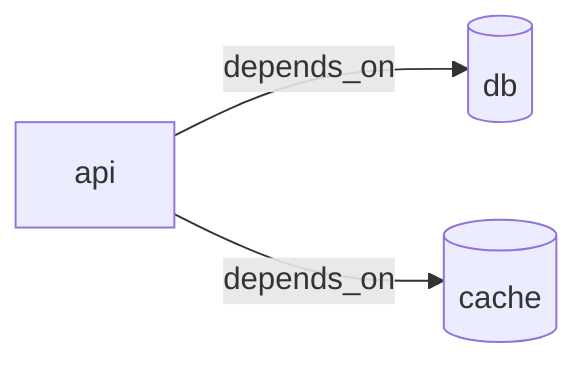

# Getting Started

Convert your docker-compose.yml into a visual Mermaid architecture diagram in minutes.

## Prerequisites

- Node.js 18 or later
- A docker-compose.yml file
- 5 minutes of your time

## 5-Minute Tutorial

### Step 1: Install

No installation required! Use npx to generate a diagram instantly:

```bash
npx docker-compose-to-mermaid generate
```

Or install globally:

```bash
npm install -g docker-compose-to-mermaid
dc2mermaid generate
```

### Step 2: Your First Diagram

Create a simple docker-compose.yml:

```yaml
version: '3.8'

services:
  api:
    image: node:18
    ports:
      - '3000:3000'
    environment:
      DATABASE_URL: postgres://db:5432/app
      REDIS_URL: redis://cache:6379
    depends_on:
      - db
      - cache

  db:
    image: postgres:15
    environment:
      POSTGRES_DB: app
      POSTGRES_PASSWORD: secret

  cache:
    image: redis:7
```

Now generate a diagram:

```bash
dc2mermaid generate
```

**Expected output:**



This diagram shows:

- **Boxes** (`api`) = regular services
- **Rounded cylinders** (`db`, `cache`) = databases and caches
- **Arrows** = dependencies between services

### Step 3: Save to a File

Instead of printing to console, save the diagram to a file:

```bash
dc2mermaid generate -o architecture.mmd
```

View the generated `architecture.mmd` file in the **[Mermaid Live Editor](https://mermaid.live)** or include it in your GitHub README:

```markdown
## Architecture


```

### Step 4: Customize the Output

#### Change the diagram direction (vertical instead of horizontal)

```bash
dc2mermaid generate --direction TB -o architecture.mmd
```

Directions:

- `LR` = left-to-right (default)
- `TB` = top-to-bottom
- `RL` = right-to-left
- `BT` = bottom-to-top

#### Add network and volume information

```bash
dc2mermaid generate \
  --include-network-boundaries \
  --include-volumes \
  -o architecture.mmd
```

#### Try the C4 diagram format

```bash
dc2mermaid generate --format c4 -o architecture.mmd
```

C4 diagrams provide a more formal, enterprise-style visualization.

### Step 5: Add a Configuration File

To avoid repeating flags, create a `.dc2mermaid.yml` file:

```bash
dc2mermaid init
```

This creates `.dc2mermaid.yml`:

```yaml
# dc2mermaid configuration
format: flowchart # flowchart | c4 | architecture
direction: LR # LR | TB | BT | RL
includeVolumes: false
includeNetworkBoundaries: false
strict: false
```

Edit the file to your preferences:

```yaml
format: c4
direction: TB
includeVolumes: true
includeNetworkBoundaries: true
```

Now just run:

```bash
dc2mermaid generate -o architecture.mmd
# Uses settings from .dc2mermaid.yml
```

### Step 6: Add to Your Project

Add diagram generation to your `package.json`:

```json
{
  "scripts": {
    "diagram": "dc2mermaid generate -o docs/architecture.mmd",
    "diagram:validate": "dc2mermaid validate",
    "diagram:check": "dc2mermaid generate --strict"
  },
  "devDependencies": {
    "docker-compose-to-mermaid": "^1.0.0"
  }
}
```

Then run:

```bash
npm run diagram
```

### Step 7: Automate with GitHub Actions

Add automatic diagram updates to your CI/CD pipeline.

Create `.github/workflows/diagram.yml`:

```yaml
name: Update Architecture Diagram

on:
  push:
    paths:
      - 'docker-compose*.yml'
      - 'docker-compose*.yaml'

jobs:
  diagram:
    runs-on: ubuntu-latest
    permissions:
      contents: write

    steps:
      - uses: actions/checkout@v4

      - uses: TamirTapiro/docker-compose-to-mermaid@v1
        with:
          output: docs/architecture.mmd
          format: flowchart
          direction: LR
          include-network-boundaries: 'true'
          commit-output: 'true'
          commit-message: 'chore: update architecture diagram [skip ci]'
```

The action will:

1. Generate the diagram whenever docker-compose files change
2. Automatically commit the updated diagram back to your repository
3. Keep your architecture documentation in sync

## Common Use Cases

### Use Case 1: Document Your Application

Generate a diagram for your README:

```bash
dc2mermaid generate -o docs/architecture.mmd
```

Add to `README.md`:

```markdown
## System Architecture


```

### Use Case 2: Validate Before Deployment

Ensure your docker-compose file is valid:

```bash
dc2mermaid validate
```

Add to CI/CD:

```bash
dc2mermaid validate --strict
# Fails if any warnings are found
```

### Use Case 3: Visualize Complex Services

For large docker-compose files with many services:

```bash
# Use top-bottom layout
dc2mermaid generate --direction TB -o diagram.mmd

# Include all details
dc2mermaid generate \
  --include-volumes \
  --include-network-boundaries \
  -o diagram.mmd
```

### Use Case 4: Multiple Environment Diagrams

Generate diagrams for different environments:

```bash
# Development
dc2mermaid generate docker-compose.dev.yml \
  -o docs/architecture-dev.mmd

# Production
dc2mermaid generate docker-compose.prod.yml \
  -o docs/architecture-prod.mmd
```

## What Gets Detected Automatically

The tool automatically infers service relationships from:

1. **`depends_on`** — Explicit service dependencies
2. **Environment variables** — Database URLs like `DATABASE_URL=postgres://db:5432/app`
3. **Port mappings** — Service connections through ports
4. **Network definitions** — Services on the same network
5. **Service names** — References to services in configuration

## Next Steps

- **[CLI Reference](cli-reference.md)** — Complete reference for all commands and options
- **[Configuration Guide](configuration.md)** — Advanced configuration options
- **[GitHub Repository](https://github.com/TamirTapiro/docker-compose-to-mermaid)** — Source code and examples
- **[Mermaid Live Editor](https://mermaid.live)** — View and edit diagrams interactively

## Tips & Tricks

### Tip 1: Use with Existing Diagrams

Combine manually-edited diagrams with auto-generated ones. The CLI respects custom edges defined in `.dc2mermaid.yml`.

### Tip 2: Keep Diagrams Current

Add diagram generation to your git pre-commit hooks:

```bash
# .husky/pre-commit
dc2mermaid generate -o docs/architecture.mmd
git add docs/architecture.mmd
```

### Tip 3: Export for Presentations

Use Mermaid Live Editor to export to PNG, SVG, or PDF:

1. Generate: `dc2mermaid generate -o diagram.mmd`
2. Open in [Mermaid Live Editor](https://mermaid.live)
3. Paste the contents of `diagram.mmd`
4. Click Download → Export as PNG/SVG/PDF

### Tip 4: Strict Mode in CI

Use `--strict` flag in CI/CD to fail builds on warnings:

```bash
dc2mermaid validate --strict || exit 1
```

### Tip 5: Multiple Compose Files

The tool can process multiple docker-compose files:

```bash
dc2mermaid generate docker-compose.yml docker-compose.prod.yml
```

## Troubleshooting

### Q: "docker-compose.yml not found"

**A:** Make sure you're in the directory containing your docker-compose file, or provide the path:

```bash
dc2mermaid generate /path/to/docker-compose.yml
```

### Q: How do I customize service labels or colors?

**A:** Edit `.dc2mermaid.yml`:

```yaml
services:
  myservice:
    label: 'My Custom Label'
    type: database # Changes shape/color

theme:
  database: '#FF0000' # Custom colors
```

### Q: Can I add relationships that aren't auto-detected?

**A:** Yes! Use the `edges` section in `.dc2mermaid.yml`:

```yaml
edges:
  - from: api
    to: external-api
    label: 'REST calls'
```

### Q: What Node.js versions are supported?

**A:** Node.js 18 or later. Check your version:

```bash
node --version  # Should be v18.0.0 or higher
```

## Get Help

- **GitHub Issues:** [Report bugs or request features](https://github.com/TamirTapiro/docker-compose-to-mermaid/issues)
- **GitHub Discussions:** [Ask questions and share ideas](https://github.com/TamirTapiro/docker-compose-to-mermaid/discussions)
- **Documentation:** [Full docs](../README.md)
