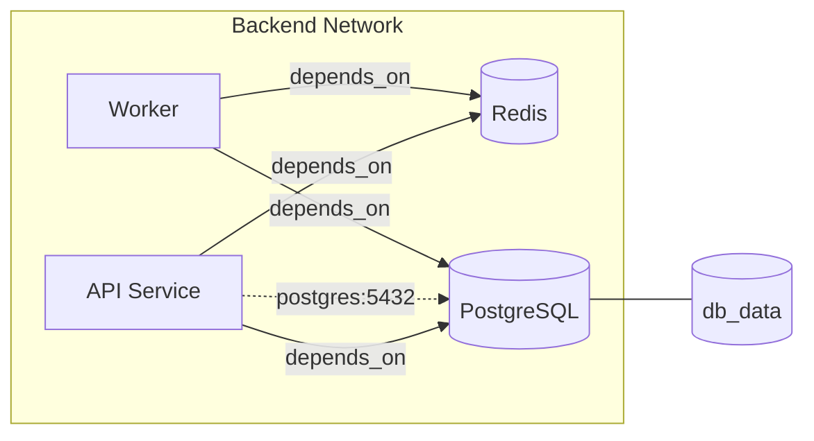
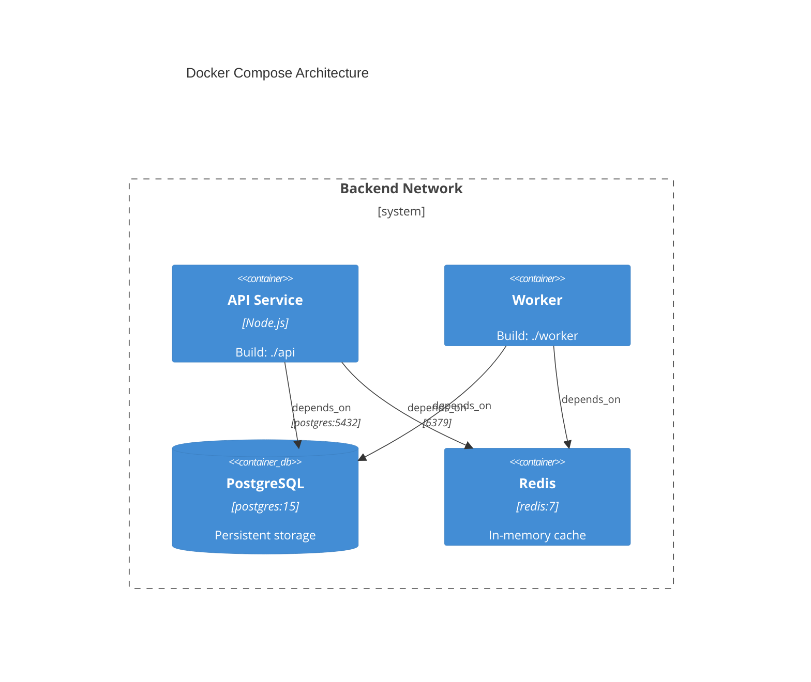

# System Architecture: docker-compose-to-mermaid

## Table of Contents

- [1. Context and Problem Statement](#1-context-and-problem-statement)
- [2. High-Level Architecture](#2-high-level-architecture)
- [3. Language, Runtime, and Key Libraries](#3-language-runtime-and-key-libraries)
- [4. Module and Package Breakdown](#4-module-and-package-breakdown)
- [5. Data Flow Pipeline](#5-data-flow-pipeline)
- [6. Internal Representation (IR)](#6-internal-representation-ir)
- [7. Relationship Inference Strategy](#7-relationship-inference-strategy)
- [8. Diagram Generation Pipeline](#8-diagram-generation-pipeline)
- [9. Output Formats](#9-output-formats)
- [10. Extension Architecture](#10-extension-architecture)
- [11. Error Handling Strategy](#11-error-handling-strategy)
- [12. Testing Strategy](#12-testing-strategy)
- [13. Technical Trade-offs and Decisions](#13-technical-trade-offs-and-decisions)

---

## 1. Context and Problem Statement

Docker Compose files are the source of truth for service topology in many projects, yet teams routinely maintain separate, hand-drawn architecture diagrams that drift out of sync within days. Keeping a Mermaid diagram next to the Compose file is a solved rendering problem (GitHub, GitLab, VSCode all render Mermaid natively), but the *translation* from YAML to diagram is manual, tedious, and error-prone.

This tool closes that gap: read one or more Compose files, infer every relationship that can be inferred, and emit a Mermaid diagram that is correct by construction. It must work fully offline, with zero external services, and be embeddable in CI pipelines.

---

## 2. High-Level Architecture

```
+-------------------+     +-----------------+     +-------------------+     +----------------+
|                   |     |                 |     |                   |     |                |
|  Input Resolution | --> |  YAML Parser &  | --> |  Relationship     | --> |  Mermaid        |
|  (file discovery, |     |  IR Builder     |     |  Inference Engine |     |  Renderer       |
|   merge, validate)|     |                 |     |                   |     |                |
+-------------------+     +-----------------+     +-------------------+     +----------------+
        ^                                                                          |
        |                                                                          v
   CLI / API                                                                 Output Handler
  (commander)                                                           (stdout, file, clipboard)
```

The architecture is a **linear pipeline** with four discrete stages. Each stage receives an immutable data structure from the previous stage and produces a new one. There is no back-pressure, no streaming, and no concurrency requirement -- a Compose file is small enough to process entirely in memory in a single pass.

The pipeline is wrapped by two boundary layers:
- **CLI layer** (upstream): parses arguments, resolves file paths, selects options, invokes the pipeline.
- **Output layer** (downstream): writes the final Mermaid string to stdout, a file, or the system clipboard.

The core pipeline (`parse -> analyze -> render`) is exported as a **programmatic API** so that the GitHub Action and VSCode extension can call it directly without shelling out to the CLI binary.

---

## 3. Language, Runtime, and Key Libraries

### Language: TypeScript on Node.js

| Criterion | TypeScript/Node.js | Go | Python |
|---|---|---|---|
| YAML ecosystem | `yaml` (spec-complete, maintained) | `gopkg.in/yaml.v3` | `PyYAML` / `ruamel.yaml` |
| CLI framework | `commander` (mature, tiny) | `cobra` | `click` |
| Distribution | npm global install, npx, single binary via pkg | Single binary | pip, pipx |
| Extension story | Native for VSCode extension, native for GH Actions (JS runtime) | Requires WASM or subprocess | Requires subprocess |
| Developer pool | Largest overlap with target users (backend/DevOps engineers already have Node) | Strong but narrower | Strong but heavier runtime |

**Decision**: TypeScript on Node.js.

Justification:
1. **Extension compatibility** is the deciding factor. Both GitHub Actions and VSCode extensions run JavaScript natively. Choosing TypeScript means the core library, the Action, and the extension share a single codebase with zero FFI or subprocess overhead. Go would require compiling to WASM or spawning a child process from both extension hosts.
2. The target audience (backend/DevOps engineers) overwhelmingly has Node.js installed already or can `npx` without friction.
3. TypeScript's structural type system lets us define the IR as plain interfaces with zero runtime cost, while still catching shape mismatches at build time.
4. For users who want a zero-dependency binary, we can produce one with `pkg` or `bun build --compile` as a future enhancement.

### Key Libraries

| Library | Purpose | Why this one |
|---|---|---|
| **yaml** (npm `yaml`) | YAML parsing | Spec-complete YAML 1.2 parser. Preserves source maps (useful for error messages pointing to line numbers). Handles anchors, aliases, merge keys -- all of which appear in real Compose files. |
| **commander** | CLI argument parsing | De facto standard for Node CLIs. Zero-config help generation, subcommand support, composable options. 7kB gzipped. |
| **clipboardy** | Clipboard write | Cross-platform clipboard access (macOS pbcopy, Linux xclip/xsel, Windows clip). Lazy-loaded -- only imported when `--clipboard` flag is used. |
| **chalk** | Terminal coloring | Conditional coloring with automatic TTY detection. Used only in the CLI layer, not in the core library. |
| **zod** | Schema validation | Validates the parsed YAML against the Compose specification schema. Provides structured error messages with paths. Chosen over JSON Schema validators for TypeScript-native inference and smaller bundle. |
| **tsup** | Build | Fast ESM+CJS dual build with declaration files. Single dependency, zero config for library builds. |
| **vitest** | Testing | Fast, TypeScript-native, compatible with Node test runner semantics. Snapshot testing for Mermaid output. |

### Libraries explicitly not used

| Library | Reason for exclusion |
|---|---|
| **@mermaid-js/mermaid** | We generate Mermaid *syntax* (plain text), not rendered SVGs. Importing the full Mermaid renderer would add ~2MB and a browser dependency for zero benefit. |
| **js-yaml** | Older, YAML 1.1 only, no source map support. The `yaml` package supersedes it. |
| **yargs** | Heavier than `commander` with features we do not need (middleware, async commands). |
| **ajv** (JSON Schema) | More verbose than zod for TypeScript projects; requires separate type generation. |

---

## 4. Module and Package Breakdown

```
docker-compose-to-mermaid/
  packages/
    core/                  # Pure library -- no CLI, no I/O beyond file reads
      src/
        index.ts           # Public API surface
        parser/
          reader.ts        # File discovery, merge resolution, YAML loading
          schema.ts        # Zod schemas for Compose spec (services, networks, volumes)
          validator.ts     # Validate parsed object against schema, emit diagnostics
        analyzer/
          ir.ts            # IR type definitions (ServiceNode, Edge, NetworkGroup, VolumeNode)
          builder.ts       # Transform validated Compose object into IR graph
          inference/
            depends-on.ts  # Extract edges from depends_on declarations
            env-url.ts     # Parse DATABASE_URL, REDIS_URL, etc. from environment vars
            network.ts     # Infer implicit connectivity from shared networks
            links.ts       # Handle legacy `links` directive
            image.ts       # Heuristic: detect well-known images (postgres, redis, mongo, etc.)
            ports.ts       # Annotate edges with port information
            index.ts       # Compose all inference strategies into a single pass
        renderer/
          base.ts          # Abstract renderer interface
          flowchart.ts     # Mermaid flowchart (default)
          c4.ts            # C4 container diagram
          architecture.ts  # Mermaid architecture diagram (beta Mermaid feature)
          theme.ts         # Color/style configuration per service type
        config/
          defaults.ts      # Default configuration values
          schema.ts        # Zod schema for .dc2mermaid.yml config file
    cli/                   # Thin CLI wrapper around core
      src/
        index.ts           # Entry point, shebang
        commands/
          generate.ts      # Main generate command
          init.ts          # Scaffold a .dc2mermaid.yml config file
          validate.ts      # Parse-only mode, report errors without generating
        output/
          file.ts          # Write to file path
          clipboard.ts     # Write to system clipboard
          stdout.ts        # Write to stdout (default)
        format.ts          # TTY-aware formatting (colors, spinners)
    action/                # GitHub Action wrapper
      action.yml
      src/
        index.ts           # Reads inputs, calls core, writes outputs/comments
    vscode/                # VSCode extension (future)
      src/
        extension.ts
        preview-provider.ts
```

### Module Responsibilities

**core/parser**: Handles all file I/O and YAML concerns. Discovers Compose files in a directory using a priority list (`compose.yaml` > `compose.yml` > `docker-compose.yml` > `docker-compose.yaml`). Merges override files using the Compose merge specification (append arrays, deep-merge maps). Validates the result against a Zod schema that models the Compose spec surface area we support. Output: a typed `ComposeDocument` object.

**core/analyzer**: Transforms the `ComposeDocument` into an intermediate representation (IR) graph. The IR is renderer-agnostic -- it models nodes (services, volumes, external services) and edges (dependencies, data flows, network membership) without any Mermaid syntax. The inference sub-module contains one strategy per relationship type; strategies are composed and deduplicated.

**core/renderer**: Accepts the IR graph and a renderer configuration, and produces a Mermaid syntax string. Each renderer (flowchart, C4, architecture) implements a common interface. The renderer is stateless -- it reads the IR and writes a string.

**cli**: Thin shell that wires `commander` options to `core` function calls and routes the output string to stdout, a file, or the clipboard. Contains all TTY-aware formatting. No business logic lives here.

**action**: GitHub Action entry point. Reads `inputs` from `action.yml`, calls `core.generate()`, and either writes the result to a file and commits it, or posts it as a PR comment.

**vscode**: VSCode extension that watches Compose files and renders a live Mermaid preview in a webview panel. Calls `core` directly as a library dependency.

---

## 5. Data Flow Pipeline

```
                  +-----------+
                  | File      |    1. Discover files on disk
                  | System    |    2. Read YAML text
                  +-----------+
                       |
                       v
              +------------------+
              |  reader.ts       |    3. Resolve file merge order
              |                  |    4. Parse each file with `yaml` library
              |                  |    5. Deep-merge into single document
              +------------------+
                       |
                       v
              +------------------+
              |  validator.ts    |    6. Validate against Zod Compose schema
              |                  |    7. Emit warnings for unknown fields
              +------------------+    8. Fail hard on structural violations
                       |
                       v
                ComposeDocument        (typed object -- services, networks, volumes, configs)
                       |
                       v
              +------------------+
              |  builder.ts      |    9. Create ServiceNode per service
              |                  |   10. Create VolumeNode per named volume
              +------------------+   11. Create NetworkGroup per network
                       |
                       v
              +------------------+
              |  inference/      |   12. Run each inference strategy:
              |    depends-on    |       a. depends_on -> direct edges
              |    env-url       |       b. env var URLs -> data-flow edges
              |    network       |       c. shared networks -> group membership
              |    image         |       d. image name -> node type annotation
              |    ports         |       e. port mappings -> edge labels
              |    links         |       f. legacy links -> direct edges
              +------------------+   13. Deduplicate and merge edges
                       |
                       v
                  IR Graph             (nodes + edges + groups, renderer-agnostic)
                       |
                       v
              +------------------+
              |  renderer/       |   14. Select renderer (flowchart | c4 | architecture)
              |  flowchart.ts    |   15. Map IR nodes to Mermaid node declarations
              |  c4.ts           |   16. Map IR edges to Mermaid arrows
              |  architecture.ts |   17. Map IR groups to Mermaid subgraphs/boundaries
              +------------------+   18. Apply theme (colors, shapes)
                       |
                       v
                Mermaid String         (plain text, ready to embed in Markdown)
                       |
                       v
              +------------------+
              |  Output Handler  |   19. Write to stdout / file / clipboard
              +------------------+
```

### Key design invariant

Every stage communicates through a **typed, immutable data structure**. No stage mutates input from a previous stage. This makes each stage independently testable and the pipeline trivially composable.

---

## 6. Internal Representation (IR)

The IR is the central data structure of the system. It must be rich enough to support all target renderers while remaining independent of any specific Mermaid diagram type.

```typescript
// --- Nodes ---

type NodeType =
  | "service"       // User-defined service (has a build or image)
  | "database"      // Inferred from image (postgres, mysql, mongo, etc.)
  | "cache"         // Inferred from image (redis, memcached)
  | "queue"         // Inferred from image (rabbitmq, kafka, nats)
  | "proxy"         // Inferred from image (nginx, traefik, haproxy, envoy)
  | "storage"       // Inferred from image (minio, localstack s3)
  | "volume"        // Named volume
  | "external"      // Service referenced but not defined in this Compose file

interface ServiceNode {
  id: string;            // Compose service name, used as Mermaid node ID
  name: string;          // Display name (defaults to id, configurable)
  type: NodeType;
  image?: string;        // e.g. "postgres:15"
  ports: PortMapping[];  // host:container pairs
  buildContext?: string;  // e.g. "./api"
  metadata: Record<string, string>;  // Arbitrary key-value pairs for labels
}

interface VolumeNode {
  id: string;
  name: string;
  driver?: string;
  external: boolean;
}

// --- Edges ---

type EdgeSource =
  | "depends_on"
  | "environment_url"
  | "shared_network"
  | "links"
  | "volumes_from";

interface Edge {
  from: string;          // Source node ID
  to: string;            // Target node ID
  source: EdgeSource;    // How this edge was inferred (for debugging/display)
  label?: string;        // e.g. "postgres:5432", "redis:6379"
  style: "solid" | "dashed";  // Solid = explicit, dashed = inferred
}

// --- Groups ---

interface NetworkGroup {
  id: string;
  name: string;
  members: string[];     // Node IDs belonging to this network
  external: boolean;
}

// --- Graph ---

interface IRGraph {
  nodes: ServiceNode[];
  volumes: VolumeNode[];
  edges: Edge[];
  groups: NetworkGroup[];
  metadata: {
    sourceFiles: string[];
    generatedAt: string;
    toolVersion: string;
  };
}
```

### Why an IR instead of direct generation?

Inserting an IR between parsing and rendering decouples the two concerns completely. Without it, adding a new renderer (say, D2 or PlantUML in the future) would require re-implementing inference logic. With the IR, a new renderer is a single function `(IRGraph) => string`.

---

## 7. Relationship Inference Strategy

Inference is the core value proposition of this tool. A naive converter that only reads `depends_on` misses most of the interesting relationships. The inference engine runs multiple strategies, each producing a set of candidate edges, then merges and deduplicates them.

### Strategy 1: `depends_on` (explicit)

The simplest and most authoritative signal. Compose v3 `depends_on` can be a list of strings or a map with conditions:

```yaml
depends_on:
  - redis                      # simple form
depends_on:
  db:
    condition: service_healthy  # extended form
```

Both forms produce a solid edge from the dependent service to the dependency. The condition is stored as edge metadata but does not change the edge itself.

**Confidence**: High. This is an explicit declaration.

### Strategy 2: Environment variable URL parsing

Many services expose connection strings via environment variables:

```yaml
environment:
  DATABASE_URL: postgres://db:5432/app
  REDIS_URL: redis://redis:6379
  KAFKA_BROKERS: kafka:9092
  MONGO_URI: mongodb://mongo:27017/mydb
```

The strategy:
1. Scan all environment variables for each service.
2. For each value, attempt to parse it as a URL (`new URL(value)` with fallback regex for non-standard schemes).
3. If the hostname portion matches a service name defined in the same Compose file, emit a dashed edge.
4. Also scan for patterns like `host:port` where `host` matches a service name.

Supported URL schemes and their inferred node types:

| Scheme | Inferred type |
|---|---|
| `postgres://`, `postgresql://` | database |
| `mysql://`, `mariadb://` | database |
| `mongodb://`, `mongodb+srv://` | database |
| `redis://`, `rediss://` | cache |
| `amqp://`, `amqps://` | queue |
| `kafka://` | queue |
| `nats://` | queue |
| `http://`, `https://` | service (generic) |

**Confidence**: Medium-high. The hostname must match a defined service name to avoid false positives from external URLs.

### Strategy 3: Shared network membership

If two services are on the same Docker network, they *can* communicate. This does not mean they *do* communicate, so shared-network edges are weaker signals.

Behavior:
- Services on the same non-default network are grouped into a Mermaid subgraph.
- No edges are emitted purely from shared network membership (that would create a fully connected subgraph, which is noise).
- Instead, network membership is used to **validate** edges from other strategies: if an env-var URL references a service on a different network, emit a warning.

**Confidence**: Low (for edges). High (for grouping).

### Strategy 4: Image-based heuristics

Well-known images reveal the *role* of a service, which improves diagram readability through node shape and color:

| Image pattern | Inferred NodeType |
|---|---|
| `postgres`, `mysql`, `mariadb`, `mongo`, `couchdb`, `cassandra`, `cockroachdb` | database |
| `redis`, `memcached`, `keydb` | cache |
| `rabbitmq`, `kafka`, `nats`, `activemq`, `pulsar` | queue |
| `nginx`, `traefik`, `haproxy`, `envoy`, `caddy` | proxy |
| `minio`, `localstack` | storage |
| `elasticsearch`, `opensearch`, `solr` | search (maps to database in IR) |
| `grafana`, `prometheus`, `jaeger`, `zipkin` | observability (maps to service in IR) |

The matching is performed against the image name with the registry prefix and tag stripped: `ghcr.io/org/postgres:15-alpine` matches `postgres`.

**Confidence**: High for type annotation. Does not produce edges on its own.

### Strategy 5: Port annotations

Port mappings (`"3000:3000"`, `"5432:5432"`) do not create edges, but they annotate existing edges with protocol and port information. When an edge from strategy 1 or 2 targets a service with an exposed port, the edge label includes the port.

### Strategy 6: Legacy `links`

The deprecated `links` directive is still present in many older Compose files. It is treated identically to `depends_on` for edge inference purposes.

### Deduplication and merge

After all strategies run, edges are deduplicated by `(from, to)` pair. When multiple strategies produce the same edge:
- The highest-confidence source wins for the `source` field.
- Labels are merged (e.g., `depends_on` edge gains port info from port annotation strategy).
- The edge style is `solid` if any contributing strategy is explicit (`depends_on`, `links`), `dashed` if all are inferred.

---

## 8. Diagram Generation Pipeline

### Supported Diagram Types

#### 1. Flowchart (default)

The standard Mermaid flowchart is the default output. It is universally rendered (GitHub, GitLab, VSCode, all Mermaid viewers) and familiar to most developers.



Node shapes encode type:
- `[name]` -- application service (rectangle)
- `[(name)]` -- database/storage (cylinder)
- `{name}` -- decision/router (diamond, used for proxies)
- `([name])` -- queue (stadium)

Edge styles:
- `-->` solid arrow: explicit dependency (`depends_on`, `links`)
- `-.->` dashed arrow: inferred dependency (env URL)
- `---` undirected line: volume attachment

#### 2. C4 Container Diagram

For teams using the C4 model, the tool can generate a C4 container diagram using Mermaid's C4 syntax:



C4 diagrams use `Container` for services, `ContainerDb` for databases, and `Boundary` for networks.

#### 3. Architecture Diagram (experimental)

Mermaid's `architecture` diagram type (currently beta) provides a more visual, icon-based layout. Support for this type is offered as experimental since the Mermaid syntax is not yet stable.

### Renderer Interface

```typescript
interface Renderer {
  /** Unique identifier for this renderer */
  readonly id: string;

  /** Render the IR graph into a Mermaid syntax string */
  render(graph: IRGraph, options: RenderOptions): string;
}

interface RenderOptions {
  direction: "LR" | "TB" | "RL" | "BT";   // Graph direction
  theme: ThemeConfig;                        // Colors, shapes
  includeVolumes: boolean;                   // Show volume nodes
  includePorts: boolean;                     // Show port labels on edges
  includeNetworkBoundaries: boolean;         // Render subgraphs for networks
  title?: string;                            // Optional diagram title
}
```

Each renderer implements this interface. Adding a new diagram type (or even a non-Mermaid output like D2 or PlantUML) requires only a new implementation of `Renderer`.

---

## 9. Output Formats

| Flag | Behavior |
|---|---|
| *(default, no flag)* | Write Mermaid syntax to stdout. Enables piping: `dc2mermaid \| pbcopy` |
| `--output <path>` / `-o <path>` | Write to a file. Creates parent directories if needed. Overwrites existing file unless `--no-overwrite`. |
| `--clipboard` / `-c` | Copy to system clipboard via `clipboardy`. |
| `--wrap markdown` | Wrap output in a Markdown fenced code block with `mermaid` language tag. |
| `--json` | Output the IR graph as JSON instead of Mermaid (for programmatic consumers). |

Stdout is the default because it composes well with Unix pipelines and is the least surprising behavior for a CLI tool.

---

## 10. Extension Architecture

### 10.1 GitHub Action

The GitHub Action is a thin wrapper that:

1. Reads Action inputs (`compose-file`, `output-file`, `diagram-type`, `comment-on-pr`).
2. Calls `core.generate()` with the appropriate options.
3. Based on configuration, either:
   a. Writes the diagram to a file and commits it (for `push` triggers).
   b. Posts or updates a PR comment containing the rendered diagram (for `pull_request` triggers).

```yaml
# .github/workflows/architecture.yml
- uses: docker-compose-to-mermaid/action@v1
  with:
    compose-file: docker-compose.yml
    output-file: docs/architecture.md
    diagram-type: flowchart
    direction: LR
```

**Package strategy**: The Action is bundled with `ncc` into a single JS file so that it requires no `node_modules` installation at runtime. The `core` package is a build-time dependency, not a runtime one.

**PR comment strategy**: The Action uses a hidden HTML comment (`<!-- dc2mermaid -->`) as a marker to find and update its own previous comment, avoiding duplicate comments on repeated pushes.

### 10.2 VSCode Extension

The VSCode extension provides:

1. **Live preview**: A webview panel that renders the Mermaid diagram when a Compose file is open.
2. **File watcher**: Automatically regenerates the diagram when the Compose file changes.
3. **Command palette**: `Docker Compose: Generate Architecture Diagram` command.
4. **Copy to clipboard**: Button in the preview panel to copy the raw Mermaid syntax.

**Rendering**: The extension uses the Mermaid library *only inside the webview* (browser context), not in the Node extension host. The extension host runs `core.generate()` to produce the Mermaid string, then sends it to the webview via `postMessage`. The webview renders it with the Mermaid JS library.

**Activation**: The extension activates on `workspaceContains:**/docker-compose*.yml` to avoid loading unnecessarily.

### 10.3 Programmatic API (core package)

Both extensions depend on the core package's public API:

```typescript
// @docker-compose-to-mermaid/core

/** High-level: file path in, Mermaid string out */
export function generate(options: GenerateOptions): Promise<string>;

/** Step-by-step for advanced consumers */
export function parse(files: string[]): Promise<ComposeDocument>;
export function analyze(doc: ComposeDocument): IRGraph;
export function render(graph: IRGraph, options: RenderOptions): string;

/** IR export for programmatic consumers */
export function toJSON(graph: IRGraph): string;
```

This three-function decomposition allows consumers to hook into any stage. For example, a custom tool might call `parse` and `analyze` but use its own renderer.

---

## 11. Error Handling Strategy

### Error Categories

| Category | Example | Severity | Behavior |
|---|---|---|---|
| **File not found** | Specified Compose file does not exist | Fatal | Exit with code 1, print file path and suggestion |
| **YAML syntax error** | Malformed YAML (tabs, missing colons) | Fatal | Exit with code 1, print line:column from source map |
| **Schema validation** | Unknown top-level key, wrong type for `ports` | Warning or Fatal | Configurable: `--strict` makes all validation errors fatal; default emits warnings and continues |
| **Inference ambiguity** | Env var URL hostname does not match any service | Info | Log at info level, skip the edge |
| **Unsupported feature** | Compose `extends` keyword, `profiles` | Warning | Emit warning, skip the unsupported section |
| **Renderer error** | IR contains a cycle that the renderer cannot lay out | Fatal | Exit with code 1 (should not happen with valid IR) |

### Error Output Format

Errors are structured for both human and machine consumption:

```
error[E001]: File not found
  --> docker-compose.prod.yml
  = help: Ensure the file exists or remove it from the --files argument.

warning[W003]: Unknown image, cannot infer service type
  --> docker-compose.yml:14:5
  | 14 |     image: mycompany/custom-service:latest
  = help: Add a type annotation in .dc2mermaid.yml to classify this service.
```

The format is inspired by Rust compiler diagnostics: error code, location with source context, and actionable help text.

### Exit Codes

| Code | Meaning |
|---|---|
| 0 | Success |
| 1 | Fatal error (file not found, parse failure, schema violation in strict mode) |
| 2 | Partial success with warnings (only when `--strict` is not set) |

---

## 12. Testing Strategy

### Test Pyramid

```
          +----------------+
          |  E2E (CLI)     |   ~10 tests
          |  Snapshot-based |
          +----------------+
         /                  \
    +----------+      +----------+
    | Integ.   |      | Integ.   |   ~30 tests
    | Parser   |      | Renderer |
    | + Infer  |      |          |
    +----------+      +----------+
   /                              \
+-------+ +-------+ +-------+ +-------+
| Unit  | | Unit  | | Unit  | | Unit  |   ~80 tests
| reader| | infer | | render| | schema|
+-------+ +-------+ +-------+ +-------+
```

### Unit Tests (~80 tests)

Each module is tested in isolation with mocked inputs:

- **reader.ts**: Given a list of file paths, returns merged YAML. Mock the file system with `memfs` or fixture files.
- **inference/depends-on.ts**: Given a `ComposeDocument` with known `depends_on` entries, produces the expected edges.
- **inference/env-url.ts**: Given environment variables with various URL formats, produces correct edges. Covers edge cases: non-URL values, external hostnames, malformed URLs.
- **inference/image.ts**: Given image strings with and without registries/tags, infers the correct `NodeType`.
- **renderer/flowchart.ts**: Given a known IR graph, produces the expected Mermaid string. Snapshot tests ensure output stability.
- **schema.ts**: Validates correct Compose documents and rejects malformed ones with the right error paths.

### Integration Tests (~30 tests)

End-to-end through the core pipeline, using real Compose fixture files:

- `fixtures/simple.yml` -- minimal 2-service file
- `fixtures/full.yml` -- the example from the seed document
- `fixtures/multi-network.yml` -- services across multiple networks
- `fixtures/env-urls.yml` -- heavy environment variable URL usage
- `fixtures/override.yml` + `fixtures/override.override.yml` -- merge behavior
- `fixtures/legacy-links.yml` -- deprecated `links` directive
- `fixtures/no-version.yml` -- modern Compose without `version` key
- `fixtures/external-volumes.yml` -- external volumes and networks

Each fixture has a corresponding `.expected.mmd` snapshot file. The test asserts that `generate(fixture)` produces output matching the snapshot.

### E2E Tests (~10 tests)

Invoke the CLI binary as a child process and verify:

- Exit code 0 for valid inputs, exit code 1 for invalid inputs.
- Stdout contains valid Mermaid syntax.
- `--output file.md` creates the file with correct content.
- `--json` produces valid JSON matching the IR schema.
- `--help` prints usage information.
- Glob patterns work: `dc2mermaid docker-compose*.yml`.

### Snapshot Maintenance

Mermaid output is deterministic (node order follows Compose file order, edge order follows strategy priority). Snapshots are updated explicitly with `vitest --update` and reviewed in PR diffs. This catches unintended rendering changes while allowing intentional ones.

---

## 13. Technical Trade-offs and Decisions

### Decision 1: IR vs. Direct Generation

**Options**:
- A) Generate Mermaid syntax directly from the parsed YAML.
- B) Build an intermediate representation, then render from that.

**Chosen**: B.

**Trade-off**: Option A is simpler and faster to implement (fewer types, fewer files, fewer abstractions). Option B costs approximately 2 additional interfaces and one extra pipeline stage. However, Option B pays for itself the moment we add a second renderer (C4), and it makes testing dramatically easier since the IR can be asserted on directly without parsing Mermaid syntax. The cost is low and the benefit is high.

### Decision 2: Zod vs. JSON Schema for Validation

**Options**:
- A) Use a JSON Schema validator (`ajv`) with the official Compose JSON Schema.
- B) Use Zod with a hand-written schema that covers the Compose surface area we support.

**Chosen**: B.

**Trade-off**: Option A gives us automatic compatibility with the full Compose spec, but the official JSON Schema is large and produces error messages that are hard to make user-friendly. Option B means we must manually maintain a subset of the Compose schema, but we get TypeScript type inference for free, the error messages are customizable, and the schema doubles as documentation for what we support. Since we do not need to validate the *entire* Compose spec (we only read the fields we use for diagram generation), the maintenance burden is manageable.

### Decision 3: Monorepo vs. Single Package

**Options**:
- A) Single npm package that exports both the library and the CLI.
- B) Monorepo with `core`, `cli`, `action`, and `vscode` packages.

**Chosen**: B.

**Trade-off**: A single package is simpler to publish and has no inter-package dependency management. However, it forces the GitHub Action and VSCode extension to depend on CLI-specific dependencies (`commander`, `chalk`, `clipboardy`) they do not need. It also makes the `core` library harder to consume programmatically since it would ship with CLI entry points and bin scripts. A monorepo with clear package boundaries (managed by pnpm workspaces or turborepo) keeps each consumer lean and enforces the architectural boundary between core logic and I/O.

### Decision 4: Inference Conservatism

**Options**:
- A) Aggressively infer edges: shared network implies connectivity, similar port numbers suggest relationships.
- B) Conservatively infer edges: only emit inferred edges when there is strong evidence (URL hostname matches a service name).

**Chosen**: B.

**Trade-off**: Aggressive inference produces more "complete" diagrams but with a high false-positive rate. A shared network between 5 services would produce 10 edges (complete graph), which is visually noisy and architecturally meaningless. Conservative inference may miss some real connections, but every edge it shows is defensible. Users can always add manual edges via the config file if the tool misses something. False negatives are correctable; false positives erode trust.

### Decision 5: No SVG/PNG Rendering

**Options**:
- A) Include Mermaid renderer to produce SVG/PNG output.
- B) Output only Mermaid syntax (plain text).

**Chosen**: B.

**Trade-off**: SVG/PNG output is convenient but requires either a headless browser (Puppeteer, ~300MB) or the full Mermaid library (~2MB + DOM dependency). This violates the "lightweight, offline CLI" goal and massively inflates install size. Since every major documentation platform (GitHub, GitLab, Notion, Confluence, VSCode) now renders Mermaid natively, the plain-text Mermaid output is directly usable in 95% of cases. Users who need SVG can pipe through `mmdc` (Mermaid CLI) themselves: `dc2mermaid | mmdc -o diagram.svg`.

### Decision 6: Configuration File Format

**Options**:
- A) JSON configuration file (`.dc2mermaid.json`).
- B) YAML configuration file (`.dc2mermaid.yml`).
- C) TOML configuration file.

**Chosen**: B.

**Trade-off**: The tool already parses YAML, so supporting YAML configuration adds zero new dependencies. The target audience works with YAML daily (Docker Compose, Kubernetes, CI pipelines). JSON lacks comments, which are valuable in configuration files. TOML would require an additional parser. YAML is the natural choice for this user base.

### Decision 7: Node.js Minimum Version

**Target**: Node.js 18+ (LTS).

**Trade-off**: Node 18 provides `fetch` globally (useful for the GitHub Action), stable `fs/promises`, and is the oldest active LTS line. Supporting Node 16 would require polyfills for several APIs. Since the target audience consists of engineers who manage infrastructure, they are likely to have a current Node.js version installed.

---

## Appendix A: CLI Interface Reference

```
dc2mermaid [options] [files...]

Arguments:
  files                          Compose files to process (default: auto-detect)

Options:
  -o, --output <path>            Write output to file instead of stdout
  -c, --clipboard                Copy output to clipboard
  -t, --type <type>              Diagram type: flowchart, c4, architecture (default: flowchart)
  -d, --direction <dir>          Graph direction: LR, TB, RL, BT (default: LR)
  --no-volumes                   Hide volume nodes
  --no-ports                     Hide port labels
  --no-networks                  Hide network boundaries
  --wrap <format>                Wrap output: markdown, none (default: none)
  --json                         Output IR as JSON
  --strict                       Treat warnings as errors
  --config <path>                Path to config file (default: .dc2mermaid.yml)
  --verbose                      Show inference reasoning
  -V, --version                  Output version number
  -h, --help                     Display help

Commands:
  generate [files...]            Generate diagram (default command)
  validate [files...]            Validate Compose files without generating
  init                           Create a .dc2mermaid.yml config file
```

## Appendix B: Configuration File Schema

```yaml
# .dc2mermaid.yml

# Diagram options
diagram:
  type: flowchart          # flowchart | c4 | architecture
  direction: LR            # LR | TB | RL | BT
  title: "System Architecture"

# Display options
display:
  volumes: true
  ports: true
  networks: true

# Service overrides (for when inference is wrong or insufficient)
services:
  api:
    type: service          # Override inferred type
    label: "REST API"      # Override display name
  custom-db:
    type: database         # Manually classify an unknown image

# Manual edges (for relationships the tool cannot infer)
edges:
  - from: api
    to: external-auth
    label: "OAuth2"
    style: dashed

# Excluded services (e.g., init containers, sidecars)
exclude:
  - migrate
  - seed

# Theme
theme:
  database: "#336791"      # PostgreSQL blue
  cache: "#DC382D"         # Redis red
  queue: "#FF6600"         # RabbitMQ orange
```
